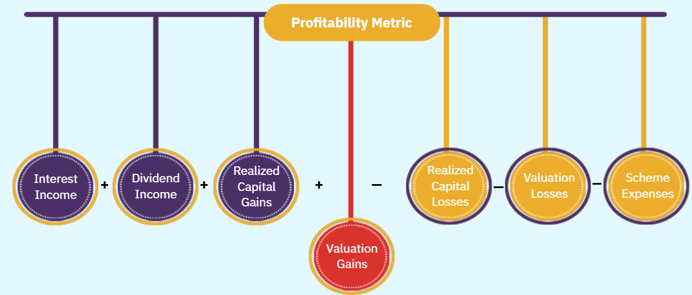

# Account Valuation and Taxation of Mutual Fund Schemes
## Calculation of NAV
We have already understood the meaning for NAV (Net Asset Value). Now, we can better understand calculation of it through an example.

### Example
Let's say investors have bought 40 crore units of a mutual fund at Rs. 10. Thus we can say that the mutual fund has mobilised Rs. 400 crore investment. At the same time an amount of Rs. 280 crore invested in equity got appreciated by 10%. An amount of Rs. 100 mobilised from investors was deposited in a bank.

Interest and dividend received through the scheme is Rs. 16 crore. The scheme experienced an expense of Rs. 8 crore and an additional expense of Rs. 8 crore is also paid.

| Particulars | Amount (Rs. crore) |
| ----------- | ------ |
| **Liabilities**  |       |
| Unit Capital (40 crore units of Rs 10 each) | 400 |
| Profits {Rs 16 crore (interest and dividend received) minus Rs 8 crore (expenses paid) minus Rs 2 crore (expenses payable)} | 6 |
| Capital Appreciation on Investments held (10 percent of Rs 280 crore) | 28 |
| Unit-holders' Funds in the Scheme | 434 |
| Expenses payable | 2 |
| Scheme Liabilities | 436 |
| **Assets** | |
| Market value of Investments (Rs 280 crore + 10 percent) | 308 |
| Bank Deposits {Rs 120 crore (original) plus Rs 16 crore (interest and dividend received) minus Rs 8 crore (expenses paid)} | 128 |
| Scheme Assets | 436 |


```
Net Asset = Amount Invested + Profit + Appreciation incurred in the investment
```

Net asset will rise whether or not profit realized due to increase in market price of securities. A scheme cannot show better profit by delaying the payments. While calculating profit all the expense related to a period needs to be considered whether or not paid. In accounting this is called as **Accrual Principle**. Similarly, any income that relates to a period will boost profit irrespective of it has been deposited in the bank account or not.

For this example
```
NAV (Value of each unit of scheme) = Unit-holder's Funds in the scheme (Net Assets) / No of outstanding units
```

So it can be calculated as
```
434 / 10 = 10.85
```

Another way of calculating NAV is
```
NAV = (Total Assets - Liabilities other than to unit holders) / No of outstanding units
```

In this example it is
```
(436 - 2) / 40 = 10.85
```

This gives us profitability matrics

```
Profitability Metrics = 
```
```
Interest Income + Dividend Income Realized + Capital Gains + Valuation Gains
```
```
-
```
```
Realized Capital + Losses Valuation Losses + Scheme Expenses
```



### Numeric Example 1
Information provided:
* Value of stocks: Rs. 300 crore
* Value of bonds: Rs. 134 сrоге
* Value of money market instruments: Rs. 4.72 crore
* Dividend accrued but not received: Rs. 2.18 croге
* Interest accrued but not received: Rs. 5.36 crore
* Fees payable: Rs. 0.72 crore
* No. of outstanding units: 3.80 croгe

```
NAV = (Value of stocks + Value of bonds + Value of money market instruments + Dividend accrued but not received + Interest accrued but not received - Fees payable) / No. of outstanding units
```

```
NAV = (300 + 134 + 4.72 +2.18 + 5.36-0.72) / 3.80 = 445.54/3.80 = Rs. 117.24
```

### Numeric Example 2
* Value of stocks: Rs. 460 crore
* Value of money market instruments: Rs. 10 crore
* Dividend accrued but not received: Rs. 4.78 crore
* Amount payable on purchase of shares: Rs. 15.0 crore
* Amount receivable on sale of shares: Rs. 4.68 croгe
* Fees payable: Rs. 0.82 crore
* No. of outstanding units: 5.30 crore

```
NAV = (460 + 10 + 4.78 +4.68-15.0-0.82) / 5.30 = 463.64/5.30 = Rs. 87.47
```

### Mark to Market
**Mark to market** is the process of valuing each security in the investment portfolio of the scheme as per its current market value.

NAV reflects the true worth of each unit of the scheme, because investors buy or sell units on the basis of the information in NAV.

In case investments are not marked to market, then the value of investment portfolio will be the same on which security was purchased.

#### Example
Valuing a company at it's aquisition cost of Rs. 30 has no meaning if the price has appreciated to Rs. 100. In case there is a scheme to sell the share then at that time then it would recover Rs. 100 not Rs. 30. So, when NAV captures the movement of shares from Rs. 30 to Rs. 100 then it is meaningful for the investors. 

* Marking to market helps investors buy and sell units of a scheme at fair prices, which are determined based on transparently calculated and freely shared information on NAV
* This mark-to-market based NAV helps in evaluating the performance of the scheme/fund manager.

### Sale Price and Repurchase Price
An unique feature of open-ended scheme is that it can keep on aquiring new units from a scheme called **Sale Transaction** or keep selling units back to the scheme called **Repurchase Transaction**.

Earlier, scheme had the option to keep **Sale Price** more than the NAV and **Repurchase Price** less than NAV. These differences are called **Entry** and **Exit** Loads respectively. These loads represent the fee collected to join or leave a scheme.

```
Entry Load = Sale Price - NAV
```

```
Exit Load = Repurchase Price - NAV
```

Entry load is no longer permitted therefore, the Sale Price is same as the NAV.

#### Example
The NAV of a scheme was Rs 22.00 per unit
The entry load charge was of 1 percent
Sale Price would be Rs 22.00 + 1 percent on Rs 22 as Rs 22.11
NAV of a scheme is Rs. 22.00 per unit
Exit load charge is of 1 percent
Re-purchase Price would be Rs. 22 minus 1 percent on Rs. 22 as Rs. 21.78

### Contingent Deferred Sales Charge
Schemes can also adjust the load in case investors want to re-purchase the units. Investors will be given concession to hold their units for longer period of time.

#### Example
If an investor holds money for 1 year exit load will be 4%. If an investor holds money for 2 years exit load will be 3%.


This kind of exit load structure is call **Contingent Deferred Sales Charge (CDSC)**.

Earlier, different types of investors were charged different exit load even under the same scheme. Also, the money collected were available for the AMC to bear expenses.

#### Current Situation
* SEBI Norms: No Entry Loads -> Sale Price = NAV
* Exit loads charges same for all the unit holders.
* Concession may be given considering future investments.
* This uniformity among unit holders will be maintained at portfolio level.
* No exit load charges on units allotted upon reinvestment of dividend and bonus units.
* Contingent Deferred Sales Charge (CDSC) and exit loads not available for the AMC to bear selling expenses.
* Investor will pay commission to distributors directly.

### Transaction Charges
SEBI has introduced transaction charge for mutual fund distributors to increase the reach of mutual fund products. This is introduced to cater to people having small savings potential or to people in urban area or smaller towns.

SEBI allows a transaction charge for per subscription of Rs. 10000/ or above to be paid to distributors of the mutual fund products. This is to help people with small saving potential and to spread awareness about mutual fund schemes. There will be no transaction charges on direct investment.

The transaction charge if any will be deducted from subscription amount and will be paid directly to the distributor. The rest amount will be invested in the scheme.

| Type of Investor |Transaction Charges (Rs.) (for purchase/subscription of Rs. 10,000 and above) |
| ---------------- | ---------------------------------------------------------------------------- | 
| First time mutual fund investor | Rs. 150/- |
| Investor other than first time mutual fund investor | Rs. 100/- |


For example if an investor invests Rs. 35,000 at NAV of Rs. 45.78.
Assuming investment from a first-time mutual fund investor, applicable transaction charge is Rs. 150.

Number of units allotted would be (Rs. 35,000 - Rs. 150) Rs. 45.78 = 761.25.

