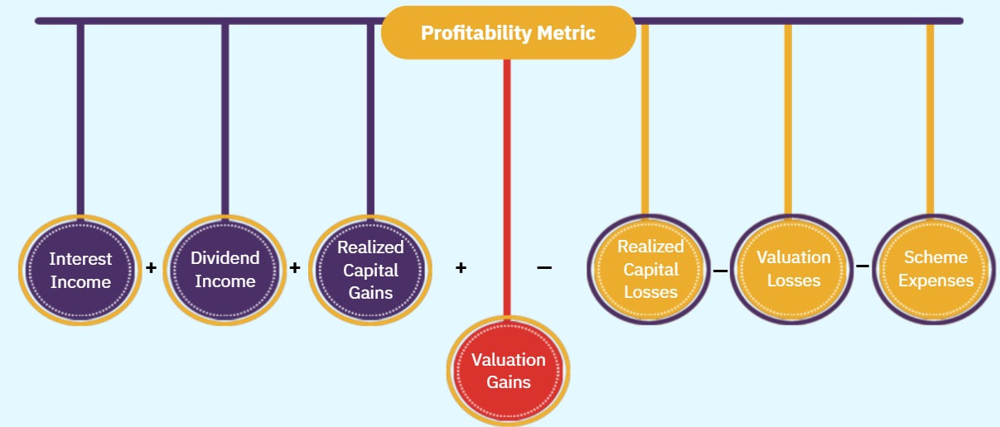

# Account Valuation and Taxation of Mutual Fund Schemes
## Calculation of NAV
We have already understood the meaning for NAV (Net Asset Value). Now, we can better understand calculation of it through an example.

### Example
Let's say investors have bought 40 crore units of a mutual fund at Rs. 10. Thus we can say that the mutual fund has mobilised Rs. 400 crore investment. At the same time an amount of Rs. 280 crore invested in equity got appreciated by 10%. An amount of Rs. 100 mobilised from investors was deposited in a bank.

Interest and dividend received through the scheme is Rs. 16 crore. The scheme experienced an expense of Rs. 8 crore and an additional expense of Rs. 8 crore is also paid.

| Particulars | Amount (Rs. crore) |
| ----------- | ------ |
| **Liabilities**  |       |
| Unit Capital (40 crore units of Rs 10 each) | 400 |
| Profits {Rs 16 crore (interest and dividend received) minus Rs 8 crore (expenses paid) minus Rs 2 crore (expenses payable)} | 6 |
| Capital Appreciation on Investments held (10 percent of Rs 280 crore) | 28 |
| Unit-holders' Funds in the Scheme | 434 |
| Expenses payable | 2 |
| Scheme Liabilities | 436 |
| **Assets** | |
| Market value of Investments (Rs 280 crore + 10 percent) | 308 |
| Bank Deposits {Rs 120 crore (original) plus Rs 16 crore (interest and dividend received) minus Rs 8 crore (expenses paid)} | 128 |
| Scheme Assets | 436 |


```
Net Asset = Amount Invested + Profit + Appreciation incurred in the investment
```

Net asset will rise whether or not profit realized due to increase in market price of securities. A scheme cannot show better profit by delaying the payments. While calculating profit all the expense related to a period needs to be considered whether or not paid. In accounting this is called as **Accrual Principle**. Similarly, any income that relates to a period will boost profit irrespective of it has been deposited in the bank account or not.

For this example
```
NAV (Value of each unit of scheme) = Unit-holder's Funds in the scheme (Net Assets) / No of outstanding units
```

So it can be calculated as
```
434 / 10 = 10.85
```

Another way of calculating NAV is
```
NAV = (Total Assets - Liabilities other than to unit holders) / No of outstanding units
```

In this example it is
```
(436 - 2) / 40 = 10.85
```

This gives us profitability matrics

```
Profitability Metrics = 
```
```
Interest Income + Dividend Income Realized + Capital Gains + Valuation Gains
```
```
-
```
```
Realized Capital + Losses Valuation Losses + Scheme Expenses
```



### Numeric Example 1
Information provided:
* Value of stocks: Rs. 300 crore
* Value of bonds: Rs. 134 сrоге
* Value of money market instruments: Rs. 4.72 crore
* Dividend accrued but not received: Rs. 2.18 croге
* Interest accrued but not received: Rs. 5.36 crore
* Fees payable: Rs. 0.72 crore
* No. of outstanding units: 3.80 croгe

```
NAV = (Value of stocks + Value of bonds + Value of money market instruments + Dividend accrued but not received + Interest accrued but not received - Fees payable) / No. of outstanding units
```

```
NAV = (300 + 134 + 4.72 +2.18 + 5.36-0.72) / 3.80 = 445.54/3.80 = Rs. 117.24
```

### Numeric Example 2
* Value of stocks: Rs. 460 crore
* Value of money market instruments: Rs. 10 crore
* Dividend accrued but not received: Rs. 4.78 crore
* Amount payable on purchase of shares: Rs. 15.0 crore
* Amount receivable on sale of shares: Rs. 4.68 croгe
* Fees payable: Rs. 0.82 crore
* No. of outstanding units: 5.30 crore

```
NAV = (460 + 10 + 4.78 +4.68-15.0-0.82) / 5.30 = 463.64/5.30 = Rs. 87.47
```

### Mark to Market
**Mark to market** is the process of valuing each security in the investment portfolio of the scheme as per its current market value.

NAV reflects the true worth of each unit of the scheme, because investors buy or sell units on the basis of the information in NAV.

In case investments are not marked to market, then the value of investment portfolio will be the same on which security was purchased.

#### Example
Valuing a company at it's aquisition cost of Rs. 30 has no meaning if the price has appreciated to Rs. 100. In case there is a scheme to sell the share then at that time then it would recover Rs. 100 not Rs. 30. So, when NAV captures the movement of shares from Rs. 30 to Rs. 100 then it is meaningful for the investors. 

* Marking to market helps investors buy and sell units of a scheme at fair prices, which are determined based on transparently calculated and freely shared information on NAV
* This mark-to-market based NAV helps in evaluating the performance of the scheme/fund manager.

### Sale Price and Repurchase Price
An unique feature of open-ended scheme is that it can keep on aquiring new units from a scheme called **Sale Transaction** or keep selling units back to the scheme called **Repurchase Transaction**.

Earlier, scheme had the option to keep **Sale Price** more than the NAV and **Repurchase Price** less than NAV. These differences are called **Entry** and **Exit** Loads respectively. These loads represent the fee collected to join or leave a scheme.

```
Entry Load = Sale Price - NAV
```

```
Exit Load = Repurchase Price - NAV
```

Entry load is no longer permitted therefore, the Sale Price is same as the NAV.

#### Example
The NAV of a scheme was Rs 22.00 per unit
The entry load charge was of 1 percent
Sale Price would be Rs 22.00 + 1 percent on Rs 22 as Rs 22.11
NAV of a scheme is Rs. 22.00 per unit
Exit load charge is of 1 percent
Re-purchase Price would be Rs. 22 minus 1 percent on Rs. 22 as Rs. 21.78

### Contingent Deferred Sales Charge
Schemes can also adjust the load in case investors want to re-purchase the units. Investors will be given concession to hold their units for longer period of time.

#### Example
If an investor holds money for 1 year exit load will be 4%. If an investor holds money for 2 years exit load will be 3%.


This kind of exit load structure is call **Contingent Deferred Sales Charge (CDSC)**.

Earlier, different types of investors were charged different exit load even under the same scheme. Also, the money collected were available for the AMC to bear expenses.

#### Current Situation
* SEBI Norms: No Entry Loads -> Sale Price = NAV
* Exit loads charges same for all the unit holders.
* Concession may be given considering future investments.
* This uniformity among unit holders will be maintained at portfolio level.
* No exit load charges on units allotted upon reinvestment of dividend and bonus units.
* Contingent Deferred Sales Charge (CDSC) and exit loads not available for the AMC to bear selling expenses.
* Investor will pay commission to distributors directly.

### Transaction Charges
SEBI has introduced transaction charge for mutual fund distributors to increase the reach of mutual fund products. This is introduced to cater to people having small savings potential or to people in urban area or smaller towns.

SEBI allows a transaction charge for per subscription of Rs. 10000/ or above to be paid to distributors of the mutual fund products. This is to help people with small saving potential and to spread awareness about mutual fund schemes. There will be no transaction charges on direct investment.

The transaction charge if any will be deducted from subscription amount and will be paid directly to the distributor. The rest amount will be invested in the scheme.

| Type of Investor |Transaction Charges (Rs.) (for purchase/subscription of Rs. 10,000 and above) |
| ---------------- | ---------------------------------------------------------------------------- | 
| First time mutual fund investor | Rs. 150/- |
| Investor other than first time mutual fund investor | Rs. 100/- |


For example if an investor invests Rs. 35,000 at NAV of Rs. 45.78.
Assuming investment from a first-time mutual fund investor, applicable transaction charge is Rs. 150.

Number of units allotted would be (Rs. 35,000 - Rs. 150) Rs. 45.78 = 761.25.

### Valuation of Securities
#### Fees Expenses and Charges
**Investment and Advisory Fees** are the expenses or fees charged to the scheme. The details of such expenses are provided in the **Offer Document**.

There are two types of important expenses that are involved in creating and managing a mutual fund.

**Initial Issue Expenses** is incurred in an NFO at the time of launching a scheme. It is a one-time expense. AMC bears this expense.

**Recurring Expenses** is a fund running expense. It is collected to manage the money invested by the investors. It is added to the scheme.

As higher recurring expenses had the effect of reducing NAV, SEBI has set the limits to such expenses.

#### List of identified expenses
* Fees of various service providers, such as Trustees, Registrar & Transfer Agents, Custodian, & Auditor
* Listing fees and Depository fees
* Brokerage and transaction cost
* Insurance premium paid by the fund
* Marketing and selling expenses including scheme advertising and commission to the distributors
* Winding up costs for terminating a fund or scheme
* Expenses on statutory investor communication, fund transfer from location to location, providing account statements and dividend redemption cheques / warrants
* Gold ETFs -> Cost of storage and handling of gold; Capital protection funds -> Cost of credit rating; Real estate mutual funds -> Cost of insurance premium and maintenance of real estate assets

#### List of charges which cannot be imposed on the scheme
* Penalties and fines for infraction of laws.
* Interest on delayed payment to the unit holders.
* Legal, marketing, publication and other general expenses not attributable to any scheme(s).
* Fund Accounting Fees.
* Expenses on investment management/general management.
* Expenses on general administration, corporate advertising and infrastructure costs.
* Depreciation on fixed assets and software development expenses.

#### Recurring Expense Limits
The total expense of the scheme apart from issue or redemption expense, irrespective of whether those charges are initially borne by the asset management company or the mutual fund in addition to the investment management and advisory fee have following limits:
* In case of a fund of funds scheme, the total expenses of the scheme including weighted average of charges levied by the underlying schemes shall not exceed 2.50 percent of the daily net assets of the scheme.
* In case of an index fund scheme or exchange traded fund, the total expenses of the scheme (including investment and advisory fees) shall not exceed 1.5 percent of the daily net assets.
* In case of any other scheme, SEBI has stipulated the following annual limits on recurring expenses (including management fees). However, the limit for the schemes investing in bonds shall be lesser by at least 0.25 percent of the daily net assets outstanding in each financial year.

| Daily Net Assets (Rs crore) | Equity Schemes | Debt Schemes |
| --------------------------- | -------------- | ------------ |
| On the first Rs. 100 crore of the daily net assets | 2.50 percent | 2.25 percent |
| On the next Rs 300 crore of the daily net assets | 2.25 percent | 2.00 percent |
| On the next Rs 300 crore of the daily net assets | 2.00 percent | 1.75 percent |
| On the balance of the assets | 1.75 percent | 1.50 percent |

Expenditure in excess of the said prescribed total expense ratio limit has to be borne by the AMC or the trustee or sponsors.

#### Disclosure of Total Expense Ratio (TER)
On a daily basis AMCs should publish TER under separate head, Total Expense Ratio (TER) for Mutual Fund Scheme, both scheme wise and date wise.
This should be made available to investors in the AMFI website in a downloadable spreadsheet format.

Any changes in base TER e.g. TER eliminating previously mentioned additional expenses and GST on investment and advisory fees in comparison to earlier base TER charged to any schemes needs to be informed to the investors via email or SMS at least 3 working day prior to affecting such changes. But in case any drop in TER due to many regulatory requirements issuance of advance notice to the investor would not be required. But drop in TER shall be informed to the investor via email or SMS and the same shall be update in the website.

The discussed changes in the base TER should be communicated to the Board of Directors of AMC along with the reason. Every quarter any change in TER with reason should be communicated to the Trustees.

#### Goods and Services Tax (GST)
* GST on fees paid, on investment management and advisory fees shall be charged to the scheme in addition to the overall limits specified earlier.
* GST on fees other than investment and advisory fees shall be charged to the scheme within the maximum limit of TER.
* GST on exit load, if any, shall be deducted from the exit load and the net amount shall be credited to the scheme.
* GST on brokerage and transaction cost paid for execution of rade, if any, shall be within the limit of TER.

#### Fees and Expenses
Mutual Funds or AMCs shall launch new scheme under a single plan and ensure that ensure that all new investors are subject to a single expense structure.

Investors who have already invested, Old Investors, per earlier expense structure based on amount of investment on different plans such as retail, institutional, and super institutional investors shall be subject to a single expense structure for fresh subscriptions. These plans will continue till such investors remain invested in the plan.

Also investor has the option to invest through direct plan. Since direct plan do not entail distributor commission they may incur lower expense ratio.

#### True and Accrued Income and Expenses
In the calculation of net assets, investments are taken at their market value. It ensures that sale and re-purchase transactions are effected at the true worth of the unit, along with the gains on the investment portfolio. The income and expense are calculated on the basis of accrual principle.

Valuation Gains will translate to Capital Gains only when the portfolio is sold.

#### Dividends & Distributable Reserves
Dividends can be paid out of distributable reserves based on below considerations:
* All the profits earned (based on accrual of income and expenses) are treated as available for distribution.
* Valuation gains are ignored. But valuation losses need to be adjusted against the profits.
* That portion of sale price on new units, which is attributable to valuation gains, is not available as a distributable reserve.

This conservative approach to calculating distributable reserves ensures that the dividend paid is out of real and realized profits after providing for all possible losses. 

* Trustees decide quantum of dividend and record date.
* NAV recalculated at the end of the record date.
* Dividend and Record date announced by AMC within 1 day of decision.
* Record date -> five calendar days from announcement by AMC.
* NAV will decline pursuant to the dividend ! pay-out and any statutory levy.

Not necessary for schemes like liquid schemes or other debt schemes with dividend distribution frequency ranging from daily to monthly.

Listed schemes to follow the listing agreement specifications for declaring and distributing dividends. There is no assurance or guarantee that the unit holders as to amount and the date when the dividend will be paid.

#### Norms of Valuation
* The NAV of the scheme will depend on the value of portfolio.
* Valuation of the securities in the portfolio to determine the Net Asset Value has to be done in accordance with the valuation norms laid down by SEBI and AMFI.

##### Key Accounting and Reporting Requirements
* The accounts of the schemes need to be maintained distinct from the accounts of the AMC. The
auditor for the AMC has to be different from that of the schemes.
* Norms are prescribed on when interest, dividend, bonus issues, rights issues etc. should be
reflected for in the accounts.
* NAV is to be calculated upto 4 decimal places in the case of index funds, liquid funds and other
debt funds.
* NAV for equity and balanced funds is to be calculated upto at least 2 decimal places.
* Investors can hold their units even in a fraction of 1 unit. However, current stock exchange trading systems may restrict transacting on the exchange to whole units.

### Taxation and Limitation
#### Definition
As per section 10(23D) of the Income Tax Act, Mutual Fund Trust are exempted from income and earnings as returns from the investments are given to the investors and these returns are taxable in the hands of investors. The mutual fund issues returns in the form of periodic dividends and increase in value of the units. So, tax obligation will depend upon the type of mutual fund scheme, the type of investor and the period of holding. The definition under income tax act for this purpose are as follows.

Equity-oriented scheme is a mutual fund scheme where at least 65 percent of the assets are invested in equity shares of domestic companies.
For calculating this percentage
* First the average of opening and closing percentage is calculated for each month.
* Then the average of such value is taken for the 12 months in the financial year.

Money market mutual funds / liquid schemes follow SEBI definition which is as below.
These type of schemes are set up with the purpose of investing completely in money market instruments (for example short term debt securities)

#### Securities Transaction Tax (STT)
In case an investor trades units of an equity fund in the stock exchange, or offers them for re-purchase to the fund, then he has to incur Securities Transaction Tax (STT).

##### STT applicable only on
Redemption
Switch to other schemes
Sale of units of equity oriented mutual funds whether traded on stock exchange or otherwise

##### STT is not applicable on
Buying the units of an equity scheme
Transactions in debt securities or debt mutual fund schemes

STT Applicability for Investors in Equity Oriented Mutual Funds
| Transaction | Rates (in percent) | Payable by |
| ----------- | ------------------ | ---------- |
| Purchase of units of equity oriented mutual fund | NIL | Purchaser |
| Sale of units of equity oriented mutual fund (delivery based) | 0.001 | Seller |
| Sale of units of equity oriented mutual funds (non-delivery based) | 0.025 | Seller |
| Sale of units of an equity oriented fund to the mutual fund | 0.001 | Seller |


#### Additional Tax on Income Distributed
STT Applicability for Investors in Equity Oriented Mutual Funds for 2018-19
| Schemes | Individual/ HUF | Domestic Company | NRI |
| ------- | --------------- | ---------------- | --- |
| Equity oriented Scheme | 10% + 12% Surcharge + 4% cess = 11.648% | 10% + 12% Surcharge +4% cess = 11.648% | 10% + 12% Surcharge +4% cess = 11.648% |
| Money Market or Liquid Schemes/ Debt Schemes (other than Infrastructure Debt Fund) | 25% + 12% Surcharge + 4% cess = 29.12% | 30% + 12% Surcharge + 4% cess = 34.944% | 25% + 12% Surcharge + 4% cess = 29.12% |
| Infrastructure Debt Fund | 25% + 12% Surcharge + 4% cess = 29.12% | 30% + 12% Surcharge + 4% cess = 34.944% | 5% + 12% Surcharge + 4% cess = 5.824% |

The surcharge mentioned above is calculated on the base tax; and the cess is calculated on the aggregate of base tax and surcharge.
There is a tax on dividend distributed by mutual fund schemes (equity and debt) which is paid by the mutual fund. The dividend that the unit holders receive is however exempt from tax in the hands of the recipient.

Resident tax payers pay a tax of 10% (plus applicable surcharge and cess) except Domestic companies and few other specified entities in case dividend income received > 10 lakh from a domestic company.

#### Concept of Indexation
Indexation means the cost of acquisition is adjusted upwards to reflect impact of inflation.

Benefits available only for long term capital gains. The government declares an inflation index number valid for every financial year so that indexation can be calculated.

Tax is payable on long-term capital gains, after indexation, at 20% + surcharge + cess.