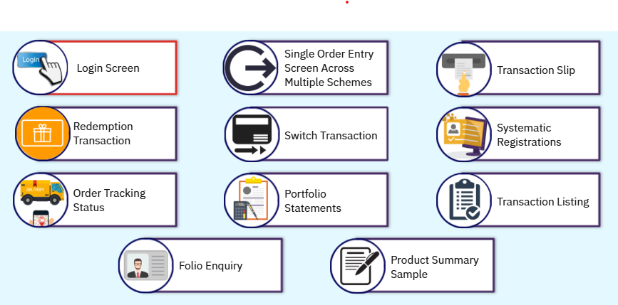

# Growth of Online Platforms For Mutual Funds
## Familiarize with NMF II and MFSS
SEBI has allowed mutual fund distributors to use exchange infrastructure for facilitating mutual fund transactions of their client. NSE has developed online platform NMF II. This online platform can facilitate
* Subscription
* Systematic Investment Plan (SIP)
* Systematic Transfer Plan (STP)
* Redemption
* Systematic Withdrawal Plan (SWP)
* Switch
* Other transactions of mutual fund units

NSE has launched MFSS platform for facilitating mutual fund transactions by it's members. At present NMF II and MFSS are two different platforms. At later stage when all the features of MFSS are made available on NMF II, MFSS will be merged into NMF II.

### Types of Transactions
There are two types of transactions.
* Financial Transactions
* Non-financial Transactions

### Financial Transactions
* Purchase (NFOs, fresh purchase, additional subscription)
* Redemptions
* Systematic Transactions
* Switch Transactions

### Non-financial Transactions
* Change in Name
* Change in Address
* Change of Broker
* Change of Dividend payout option
* Change of Redemption payout option
* Change of Tax status
* Consolidation of Folios
* Lien Marked
* Lien Removed
* NFO Trades reject
* PAN Change
* Registration of nominee

The platform has a provision to enter details pertaining to non-financial information updating. The request for updating non-financial information along with relevant documents has to be submitted at the service centre for onward submission to RTAS. Investor login does not have provision for updating non-financial information.

## KYC
The investor has to be KYC compliant to be able to transact on the platform.

Fresh Investor's KYC, Investor's KYC Not verified, Investor's KYC Not submitted the distributor shall
* Do the initial due diligence/In-person verification
* Upload the KYC information and supporting scanned documents on the KRA system directly

KRA shall
* Process the KYC application
* Verify documents
* Provide the KYC acknowledgement to the investor

NMF II supports payment of subscription amount by cheque, demand draft, online payment through RTGS/ NEFT, internet banking and debit card.

## Features of NMF II
Here are the features of NMF II
* Multiple transactions through single cheque or single fund transfer
* Multiple modes to make payment ie. cheque, net banking, RTGS/NEFT, debit card
* Demat as well as non demat transactions facilitated through the platform
* Mail reports from RTA, facilitated on platform
* Facility of Switch/SIP/SWP/STP available on the platform
* Supports non-financial transactions

### Benefits of NMF II
* Single consolidated view of investments done through multiple brokers/distributors.
* Single cheque for multiple investments.
* Access to the platform for online transactions.
* Single registration number on the platform.
* Reduction in risk associated with paper.

## Analysis of NMF II
### NMF II Application
Below are the screenshots of various transactions done through the application

### NAV Cut-Off Timings
| Scheme Type | Subscription Amount | Order Entry Time(T-day) | Cheque Criteria | Deposit Cut off Time at MF Simplified Service Centers (T-day) | Applicable NAV-Subject to funds Clearance in NSCCL Pool Account and transfer to the AMC Scheme Account |
| ----------- | ------------------- | ----------------------- | --------------- | ------------------------------------------------------------- | -------------------------------------------------------------------------------- |
| Non-Liquid | Less than INR 2 Lakh | Before 3 PM | Any Bank | 05:00PM | T Day |
| Liquid | Less than INR 2 Lakh | Before 11:30 AM | HDFC Bank | 12:30PM | T day-(if funds are transferred and credited to scheme accounts after 2 PM on T day and up to 2 PM on T+1 day).  T-1 NAV (if funds are trnsferred and credited to scheme accounts before 2 PM on T day) |
| Non-Liquid | More than INR 2 lakh | Before 11:30 AM | HDFC Bank | 12:30PM | T + 1 Day (If funds are transferred and credited to scheme accounts before 3 PM on T 41). T Day (if funds are transferred and credited to scheme accounts before 3 PM on T day) |
| Liquid | More than INR 2 lakh | Before 3 PM | Non HDFC Bank | 05:00PM | T Day provided funds are transferrred and credited to scheme accounts before 2 PM on T +1 day. T + 1 Day provided funds are trnansferred and credited to scheme accounts after 2 PM on T + 1 day before 2 PM on T + 2 day |
| Non-Liquid | More than INR 2 lakh | Before 3 PM | Non HDFC Bank | 05:00PM | T + 1 Day if funds are trnsferred and credited to scheme accounts before 3 PM on T + 1 |