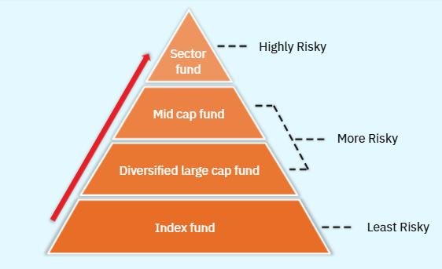
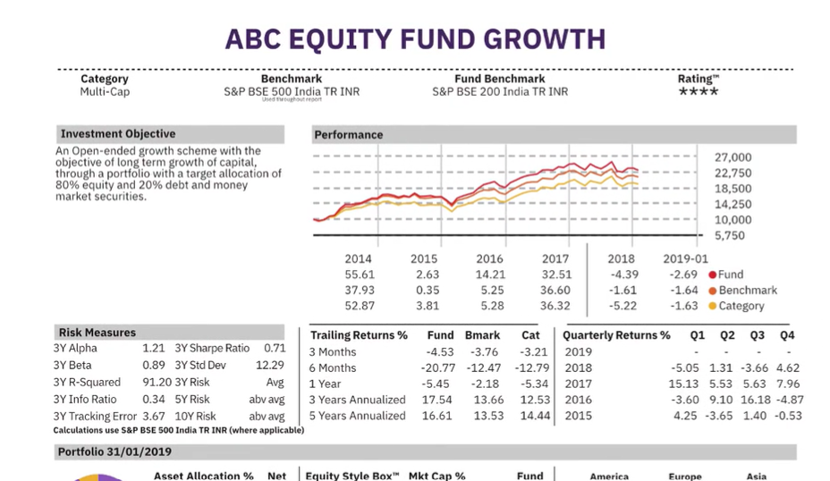
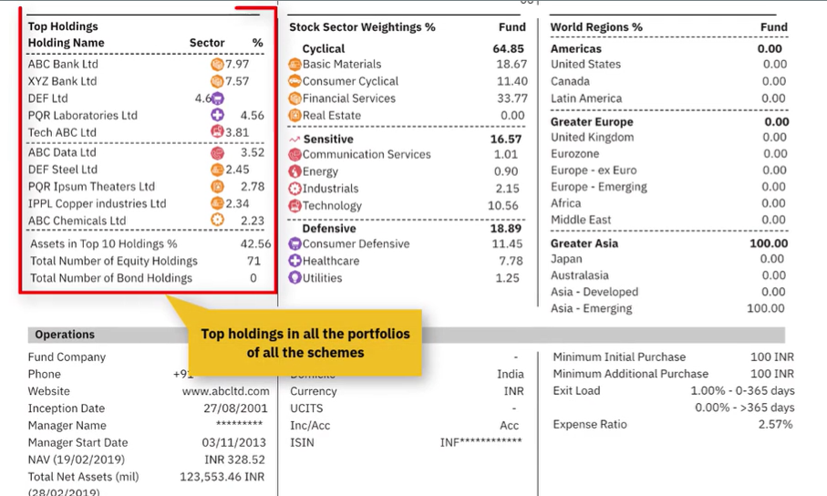
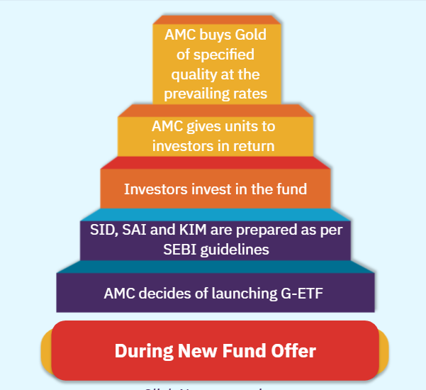
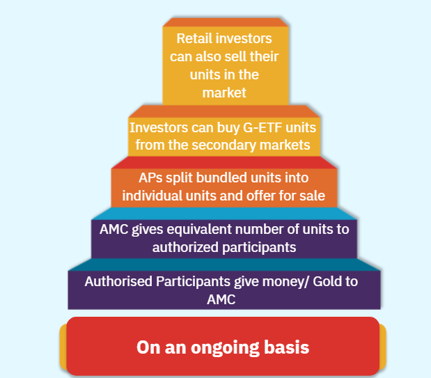
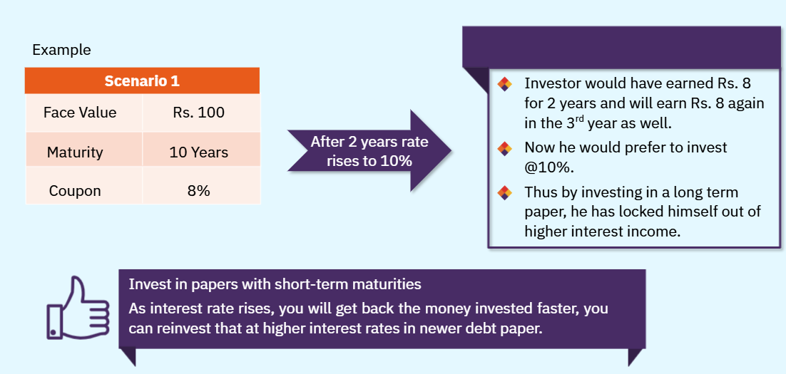

# Products & Features of Funds
## Mutual Fund Schemes
* Equity Funds: These are funds which primarily invest in equity shares of companies
* Debt Funds: These are funds which invest in debt instruments such as short and long term bonds, government securities, t-bills, corporate paper, commercial paper, call money etc.
* Hybrid Funds: These are funs which invest in debt as well as equity instruments
* Gold Funds: This is an exchange traded fund that buys and sells gold.
* Real Estate Funds: These funds invest in properties.

## Types of Funds
Based on entry and exit criteria of investors, funds are of two types.
* Open-Ended Fund
* Close-Ended Fund

### Open-Ended Fund
* Allows investors to enter and exit at his convenience
* Allows investors to buy the units even after the NFO period is over
* The buy/sell of units takes place at the Net Asset Value (NAV) declared by fund

**Note:**
* A new fund is launched by AMC, is known as New Fund Offer (NFO)
* Units are offered to investors at the par value of Rs. 10/unit
* When the fund sells units, the investors buy the units from the fund and when the investor wishes to redeem units, the fund repurchases the units from the investor. This can be done even after the NFO has closed

### Close-Ended Fund
* Restricts the freedom of entry and exit
* Allows investors to invest only during NFO period; that is as long as the scheme is open for subscription
* Does not allow new investors to enter or existing investors to exit once the NFO closes and till the term of the scheme comes to an end
* Lists its schemes on stock exchanges in order to provide entry and exit options to investors
* Provides opportunity for investors to buy and sell the units from each other
* Is just like buying/selling shares on the stock exchange and is done through a stock broker

**Note:**
The outstanding units of the fund does not increase/decrease since the fund itself is not selling any units.

Sometimes, close ended funds also offer 'buy-back of fund shares/units', thus offering another avenue for investors to exit the fund.

Therefore, regulations drafted in India permit investors in close ended funds to exit even before the term is over.


Based on type of involvement of fund manager, funds are of two types.
* Actively Managed Funds
* Passive Funds

### Actively Managed Funds
* These are funds wherein the fund manager is:
    * Actively involved and has a greater role to play
    * Free to choose the investment portfolio
* The flexibility is limited by broad parameters of the investment objective of the scheme
* Since these funds require the fund manager's active involvement, the expenses for running the fund are higher
* Investors expect these types of funds to perform better than the market

### Passive Funds
* These funds invest based on a specific index of whose performance it seeks to track
* For example, if a particular fund is tracking Nifty 50, it would buy only those shares that are part of the composition of the Nifty 50
* Each share in the scheme's portfolio will be of the same proportion as that of the weightage assigned to the share in the computation of the Nifty 50
* Hence, the performance of these funds reflects the concerned index
* These are not designed to perform better than the market. Since it is the index itself which decides the portfolio of these funds, they are called Index Schemes.
* The fund manager has no role to play in deciding on investments and hence have these funds have a low running costs.


### Exchange Traded Funds (ETFs)
These funds are passive funds. The portfolio of this fund replicates an equity market index or a commodity index. The units are offered in a New Fund Offer (NFO). Post NFO, they are open for sell and purchase in a stock exchange. The units are credited to investor's demat account. Post NFO transactions are performed to trading and settlement platform of stock exchange. The ETF units are traded at realtime prices which are linked to changes in underlying index.

### Equity-Oriented Funds
Equity fund account for around 40% of total AUM (Assets under management) in mutual fund.

Equity schemes are those scheme which have investment objectives to invest largely in equity shares and equity-related investments like convertible debentures. Investment object of such funds is to seek capital appreciation through investment in this growth asset.

Fund manager perform research and identify companies with good future prospects and invest in the shares of such companies. Prices of listed securities fluctuate based on liquidity, international scenario and numerous other factors. Therefore, investment in equity funds carries higher risk. Investors should understand the features of equity investments in terms of risk and return before investing.

#### Definition
Equity-Oriented schemes are funds which invest investors' money in equity and related instruments of companies. Secion 115T of the Income Tax Act, 1961 lays down that equity oriented funds means such fund where the investible funds are invested by way of equity shares in domestic companies to the extent of more than 65% of the total proceeds of such fund.

In case of equity funds, investors need not pay long term capital gains upto 1 lakh earned by them. Hence, it is important that the investment norm is met by the fund.

#### Types of Funds
There are various types of equity funds are
* Index Funds
* Diversified Large Cap Funds
* Sector Funds
* International Funds
* Gold Funds
* Fund of Funds

Based on market capitalisation Equity-Oriented funds can also be classified as 
* Large Cap Funds
* Mid Cap Funds
* Small Cap Funds

Base on investment strategy of schemes, it  can be classified as
* Index Funds
* Sectoral Funds
* Arbitrage Funds
* Fund of Funds

### Risk Pyramid
Equity funds do not guarantee any minimum returns.

Index Funds are least risky. Diversified large cap fund and Mid cap fund are riskier funds. Sector fund are highly risky funds. Refer to below depiction.



##### Index Funds
Index funds are less riskier funds. Index funds invest in stocks comprising of indices, such as Nifty 50. Nifty 50 is a broad based index comprising of 50 stocks. Funds on other indices can have a large number of stocks as the Nifty Midcap 100 or Nifty 500. Here investment is spread across a large number of stocks. Today, we see large of of Index Funds which comprises of **Large**, **Liquid**, **Blue Chip** 50 stocks.

The object of a typical Index Funds states "This stock will invest in stocks comprising of 50 and in the same proportion as in the index.
* The fund manager will not indulge in the stock selection
* Fund manager will invest passively in Nifty 50 scripts only
* Due to this, Index Funds are known as passively managed funds
* Lower costs and returns
* Closely tracks the bench mark index

###### Tracking Error
It is the difference between return generated by Benchmark Index and the Index Fund

```
Tracking Error = (Returns generated by Benchmark Index) - (Returns generated by Index Fund)
```

Fund with least **Tracking Error** are
* most preferred by investors
* Tracks the index closely
* A function of the scheme expenses. It means lower the expenses lesser the **Tracking Error**

##### Equity Scheme
* Equity is ownership in the company which has issued shares to the extent of shares held. Shareholders exercise their voting rights which are associated with the shares they hold, and take part in the management of the company.
* In addition to this, they take part in the residual profits of the company, that is, the profits remaining after all the dues and claims against the company have been met in the form of dividends.
* The shareholders benefit from the profit and revenues of the company in the form of high dividends they may be paid.
* However, equity holders are not given any assurance that dividend will be paid or about the amount that would be paid as dividend.
* If a particular company attains distributable profits, the management decides to use the profits for expansion plans, paying off debt and other financial activities which are expected to increase the value of the shares of the company.
* In such situations the company may not pay any dividends to the shareholders. Apart from dividends, equity investors benefit from the appreciation in the value of the shares.
* Investing in equity is investment in a growth-oriented asset.
* The investor benefits from the appreciation in the value of the investment. When there are adequate profits the company declares the dividends and provides periodic income to the shareholders.

##### Debt Schemes
* The borrowings of the issuer are represented as debt
* As an asset class, debt represents an income-oriented asset
* The major source of return from a debt instrument is regular income in the form of interest which is typically known at the time of issue
* This may be guaranteed either by an undertaking of the government or by security created on the physical assets of the issuer
* The conditions such as the coupon or interest payable on the debt, the tenure of the borrowing after which the borrower/issuer has to return the principal to the lenders/investors, the security against the assets of the borrower offered as collateral, and so on are determined by the terms of issue.

##### Hybrid Scheme
* Hybrid funds have an investment charter which gives scope for investment in both debt and equity.
* Some of them invest in gold along with either debt or equity or both.

##### Solution Oriented Scheme
* Solution-Oriented Schemes are those schemes with an investment objective directed towards a specific goal aimed in future.
* For example, retirement solution or investments for children are called Solution Oriented Schemes.

#### Types of Schemes Based on Market Capitalisation
As you may already be aware, Cap or Market Capitalisation is the total value of a company based on the current market price of share multiplied by the no of share outstanding. Based on Cap companies are classified as.
1. Large Cap Companies: Top 100 or 200 stocks which feature in Nifty 50
1. Mid Cap Companies: Stocks below large cap which belong to mid cap segment
1. Small Cap Companies: Stocks with market capitalisation of less than Rs. 5000 cr

Large cap funds are those that have
1. Sound businesses
1. Strong management
1. Globally competitive products
1. Quick to respond to market dynamics

Diversified large cap funds are considered as stable and safe. These stocks command high liquidity. However, equity funds are
1. Risky asset class
1. No guarantee for any type of fund
1. Actively managed

##### Actively Managed Funds
Except index fund, all other funds are actively managed funds. They have higher expenses as compared to index funds. Fund manager invests in stock beyond the index. Any stocks that involve active decision making may incur higher expenses and hence higher risks. Risk level increases from Index Fund, Large Cap Fund, Mid Cap Fund to Small Cap Fund. The conclusion here are actively managed funds
1. should deliver higher returns than the index
1. investors must be compensated for higher risks
1. studies have shown most actively managed funds are unable to beat the index returns on a consistent basis. There is no gurantee as to which actively managed fund will beat the index in a given year
1. Index funds have grown exponentially in some countries due to the inconsistency of returns

##### Mid Cap Funds
* Invest in stocks belonging to the mid cap segment of the market
* Many of these midcaps are said to be the 'emerging blue chips' or 'tomorrow's large caps'
* There can be actively managed or passively managed mid cap funds. There are indices such as the Nifty MID 100 and Nifty Midcap 50 indices which track the midcap segment of the markets
* There are some passively managed index funds investing in the Nifty MID 100 and Nifty Midcap 50 companies

##### Sectoral Funds
* Funds that invest in stocks from a single sector or related sectors are called Sectoral funds
* Examples of such funds are Banking Funds, IT Funds, Pharma Funds, Infrastructure Funds, etc.
* Regulations do not permit funds to invest over 10% of their Net Asset Value in a single company
* This is to ensure that schemes are diversified enough and investors are not subjected to concentration risk
* This regulation is relaxed for Sectoral funds and Index funds

#### Equity Schemes
Various other types of **Equity Schemes** are
1. Arbitrage Funds
1. Multi cap Funds
1. Quant Funds
1. International Equities Funds
1. Growth Schemes
1. Equity Linked Savings Schemes (ELSS)
1. Fund of Funds

##### Arbitrage Funds
* These funds invest in the cash and the derivatives market simultaneously
* They take advantage of the price differential of a stock in the cash and derivative segment by taking opposite positions in the two markets
* Examples of these types of funds are cash and stock futures

##### Multi cap Funds
* These funds can, theoretically, have a small cap portfolio today and a large cap portfolio tomorrow.
* The fund manager has total freedom to invest in any stock from any sector.

##### Quant Funds
Quantitive models are used for stock selection and allocation of weights. Selection and allocation is based on company's
* Size
* Financial performance
* Liquidity

SID (scheme information document) - specifies the use of a quantitative model
* Stock Price which includes parameters based on periodic moving average of price, market capitalisation
* Financial parameters which are based on key indicators such as EPS, PE, PAT, EBDIT margins (historical and forecasted).

##### International Equities Funds
It invests in stocks of companies outside India. It can be
* Fund of Funds - invests in other mutual funds
* Fund which directly invests in overseas equities

These funds can further be designed as
* International Commodities Securities Fund
* World Real Estate and Bank Fund

##### Growth Schemes
These schemes aim for capital appreciation by investing in growth funds. They focus on industries and specific companies experiencing revenue growth rather than companies that payout dividend. These companies are in growth phase so, requires a holding period of at least 5 to 10 years and thus a higher risk tolerance. Time horizon for return is medium to long term.

###### Example
PU Mutual fund is investing in growth companies. It's **investing objective** is invest in companies/stocks with high growth rates or above average potential. The fund manager will follow an active investment strategy and focus on rapid growth companies or sectors. The selection of stocks will be based on growth measures such as
1. Enterprise value/EBITA
1. Forward price/sales
1. Discounted EPS (Earning Per Share)

The primary focus of these funds is to identify high growth companies especially on sector witnessing above average growth. A combination of Top-Down macro analysis approach to identify sectors and Bottom-Up approach micro analysis to pick stocks within these sectors will be employed. Switch between companies and sectors is identified based on
* Relative Valuations
* Liquidity
* Growth potential

##### Equity Linked Savings Schemes (ELSS)
These schemes invest in equity schemes where investors get tax benefit up to Rs. 1.5 lakhs under section 80C of the Income Tax Act. These are Open-Ended schemes with locking period of 3 years. These schemes are designed for dual purpose of equity investing as well as tax planning for the investor. On these schemes investors cannot get their money back before 3 years from the date of investment under any circumstances.

##### Fund of Funds
These funds do not invest directly in stocks or share. They invest in units of other mutual funds which perform well and give high returns.

#### Growth and Value Investing
##### Growth Investing
* Investing in companies with high growth potential
* Look for companies that are experiencing significant earnings or revenue growth
* Investors look for growth momentum

The risk of growth investing is that if growth momentum goes down slightly stock's price can go down rather fast

##### Value Investing
* A sector/stock is currently undervalued and market will eventually realize it's true value
* Investors buy undervalued stock/sector and wait for value to move up and then exit
* Investors look for mismatch between the current market price and the true value of the investment

The risk of growth investing is that the investor may have to wait a really long time before the market values the investment correctly

#### Contra Funds
Contra fund follow a value investing approach. 

##### Example
When interest rate rise, people defer their purchases as the cost of borrowing increases. This affects bank, housing and auto sector. Stocks of these companies come down. Hence the fund manager will opine that when the interest rates come down these stocks will go up again. Thus, he will buy these stocks when nobody wants them. He will take a contrarian call. 

#### Assets Under Management (AUM)
AUM represents the money which is managed by a mutual fund in a scheme. Sum of AUMs of all schemes represents AUM of a fund house. Sum of AUMs of all fund houses represents industry AUM.

```
AUM = (Net Asset Value (NAV) of a scheme) x (Number of units issued by the scheme)
```

Change in AUM happens due to redemptions of inflows. If sharp market fall happens then NAV will move down. It leads to redemption pressure and AUMs may come down. If outlook is positive, it leads to inflow of funds leading to overall increase in the AUM. If the fund produces superior returns then the benchmark index it results into inflows into the scheme, leading to an increase in AUM.

### Net Asset Value (NAV)
```
Net Asset = (Market value of scheme assets) - (Market value of scheme liabilities)
```

```
NAV = (Net Asset) / (No of units outstanding)
```

Formula for NAV is:

```
NAV = ((Market value of investments + receivables + accrued income + other assets) - (accrued expenses + other payables + other liabilities)) / No. of units outstanding as of valuation date
```

### Fund Fact Sheet
Investor must monitor their investments regularly. This can be achieved by going through fund fact sheet. This is a monthly document which all mutual funds have to publish. It is an important document which provides below critical financial information.
* AUMs of all it's schemes
* Top holding in all the portfolio
* Exit Load, minimum investment
* Performance over 1, 3 and 5 years and also since launch
* Comparison of scheme performance with benchmark index
* Fund manager outlook
* Portfolio comparison and composition
* Expense ratio
* Folio turn over
* Risk adjusted returns
* Equity or debt splits for schemes
* YTM for debt portfolios

Fund Fact Sheet example



### Scheme Expenses
There are two types of expense incurred by a scheme
1. Initial Expenses
1. Recurring Expenses

#### Initial Expenses
This expenses are incurred when NFO is made. It is borne by the AMC.

#### Recurring Expenses
These are expenses that are incurred regularly. It includes.
1. Fees paid to trustees, custodians, auditor, registrar and transfer agents
1. Selling and commission expenses
1. Listing fees and depository fees
1. Expenses related to investor communication
1. GST

#### SEBI Limits for Expenses
The limits for expenses are laid down by SEBI.

| Net Assets | Equity Schemes | Debt Schemes |
| ---------- | -------------- | ------------ |
| Upto Rs.100 Cr. | 2.5 % | 2.25 % |
| Next Rs.300 Cr. | 2.25 % | 2.00 % |
| Next Rs.300 Cr. | 2.00 % | 1.75 % |
| Excess over Rs.700 Cr. | 1.75 % | 1.50 % |

* Percentages to be calculated on the average daily net assets of the scheme.
* The expense limits including management fees for index schemes, including Exchange Traded Funds, is 1.5% of average net assets.
* Fund of funds scheme: Total expenses of the scheme
should not exceed 2.50 per cent of the average daily net assets of the scheme.

Some more costs or expenses charged to the scheme are:
* Brokerage and transaction costs are included in the cost of investment, not exceeding 0.12% in case of cash market transactions.
* 0.05% in case of derivatives transactions.
* Expenses not exceeding 0.30% of daily net assets, if the new inflows are at least.
    * (i) 30 per cent of gross new inflows in the scheme, or,
    * (ii). 15 per cent of the average assets under management (year to date) of the scheme, whichever is higher.

If inflows from such cities is less than the higher of sub-clause (i) or sub- clause (ii), such expenses on daily net assets of the scheme shall be charged on proportionate basis.
* Additional expenses not exceeding 0.20 per cent of daily net assets of the scheme.

Expenditure in excess of the limits specified shall be borne by the Asset Management Company (AMC) or by the trustees or by the sponsors.

The AMC should launch new schemes under a single  plan and ensure that all new investors are subject to a single expense structure. Investors, who have invested as per earlier expense structures will be subject to a single expense structure for all fresh subscription.

### Expense Ratio
Expense ratio is one of the most important aspects an investor needs to check before finalising a scheme. Expense ratio is the ratio of expenses incurred by a scheme to its Average Weekly Net Assets.
* It indicates how much of investors' money is going for expenses and how much is getting invested.
* This ratio should be as low as possible
* Investors today have an option of investing through direct plans.
* Since the direct plan do not entail distributor commissions, they may have a lower expense ratio.

* Assume that a scheme has average weekly net assets of Rs 100 cr. and the scheme incurs Rs.1 cr. as annual expenses, then the expense ratio would be 1/100 = 1%.
* In case this scheme's expense ratio is comparable to, or better than that of its peers, then this scheme would qualify as a good investment, based on this parameter only.
* If this scheme performs well and its AUM increases to Rs. 150 cr. in the next year whereas its annual expenses increase to Rs. 2 cr, then its expense would be 2/ 150 = 1.33%.
* It is not enough to compare a scheme's expense ratio with that of its peers. The scheme's expense ratio must be tracked over different time periods.
* Ideally as net assets increase, the expense ratio of a scheme should come down.

### Portfolio Turnover
* Fund Managers churn their portfolio depending upon outlook.
* The mandate of the scheme and the fund manager's outlook and style determine the churning.
* Very high churning frequency leads to higher trading and transaction costs.
* Portfolio Turnover is the ratio which helps us to find how aggressively the portfolio is being churned.
* Churning has no impact on the Expense Ratio.
* Transaction costs are included in the buying & selling price of the scrip by way of brokerage, STT, cess, etc.

#### Definition
* Portfolio Turnover is defined as 'Lesser of Assets bought or sold/ Net Assets'.
* A scheme with Rs.100 crore as net assets sells Rs.20 crore of its investments. Thus its Portfolio Turnover Rate would be 20/100 = 20%.
* If this scheme's net assets increase to Rs.120 crore and the fund manager decides to churn the entire portfolio by exiting all stocks, then the Portfolio Turnover would be 120/120 = 100%.
* If the fund manager churns the entire portfolio twice in a single year then we would say that the Portfolio Turnover rate is 200% or that the portfolio is churned once every 6 months.
* Liquid funds have very high portfolio turnover due to less maturity of the paper. Once the paper matures, the fund manager has to buy another security, thus churning the portfolio.

#### Impact of AUM on Portfolio Turnover
* The scheme's size, that is, the AUM can also have an impact on the performance of the scheme. In case the scheme performs well and thereby attracts a lot of money flow, it may happen that the fund manager may not be able to deploy that extra money successfully as he may not find enough opportunities.
* Thus an increased fund size may result in lower returns. If the fund manager tries to acquire significantly large quantities of a stock, the buying pressure may lead to higher stock prices, thereby higher average cost for the scheme.
* Besides, if the holdings by the scheme in any stock are huge, then exit may be difficult as selling from the scheme itself can put pressure on the prices. Thus, the first share may be sold at a higher price and as the supply increases the prices may fall, and the last share may get sold at a lower price.

#### Cash levels in portfolios
* The cash level is the amount of money the mutual fund is holding in cash, that is, the amount not invested in stocks and bonds but lying in cash.
* If the scheme has higher than industry average cash levels consistently, more so in a bull market, it will lead to a inferior performance by the scheme than its peers. However, in a falling market, it is this higher cash level that will protect investor wealth from depleting.
* Hence, whenever one is analyzing cash levels, it is extremely important to see why the fund manager is holding high cash levels. It may be so that he is expecting a fall therefore he is not committing large portions of monies.
* It may be so in a bull market or a bear market. The strategy could be to enter once the prices correct. High cash levels can also be seen as a cushion for sudden redemptions and in large amounts.


### Exit Load
* Paid if investors exit the scheme before a specified time period
* Reduce the amount received by the investor
* Not applicable for all schemes
* Not all schemes have similar exit loads

#### Contingent Deferred Sales Charge (CDSC) :
* A modified form of Exit Load
* Investor has to pay different Exit Loads depending upon his investment period

#### Upfront commission to distributors
Paid by the investor directly, based on his assessment of various factors including the service rendered by the distributor.


For equity funds/bonds redeemed within 1 year are charged an exit load of 1%. However, liquid funds and money market funds normally have 0 exit load.

### Exchange Traded Funds (ETFs)
#### Definition
Exchange Traded Funds abrreviated as ETFs are mutual fund units that investors buy or sell from Stock Exchange as against a normal mutual fund unit which investors buy or sell through distributor or the AMC. ETFs have relatively lesser costs as compared to mutual fund scheme due to largely based on structure of ETFs.

In case of mutual fund the AMC deals directly with distributors or investors. However, the ETFs structure is such that the AMC does not have to deal directly with distributors or investors. It instead issues units to few designated large participants also called as authorized Participants (APs). Authorized Participants (APs) act as market maker for ETFs.

The APs provide two way quotes for the ETFs on the stock exchange which enables investors to buy and sell ETFs at any given point in time when the Stock Exchange is open for trading. So, ETFs trade like stocks. Buying and selling ETFs is similar to buying and selling shares in stock exchange. Prices are available in realtime and trading can be done through a broker in Stock Exchange.

#### Tracking Error
Due to lower expenses, the Tracking Error for an ETF is usually low. Tracking Error is the acid test for an index fund/ETF. By design an index fund/index ETF should only replicate the index return.

```
Tracking Error = (Returns Generated by the scheme/ETF) - (Returns Generated by the index) 
```

#### Assets in ETF
There are assets in 
* Gold
* Silver
* Nifty 50 Indices

in India.

##### Nifty 50 ETF
* An index ETF is one where the underlying is an index, say Nifty 50.
* The APs deliver the shares comprising the Nifty.
* The APs provide liquidity to shares by offering buy and sell through the stock exchange.
* The APs give two way quotes, buy and sell quote for investors to buy and sell the ETFs.

#### Features
Exchange Traded Fund (ETF) is essentially a scheme where the investor has to buy and sell units from the market through a broker. An investor must have a Demat account for buying ETFs.

An important feature of ETFs is the huge reduction in cost. A typical Index fund would have expenses in the range of 1.5% of Net Assets, an ETF might have expenses around 0.75%. In fact, in the international market these expenses are even lower. In India too, this may become the trend once more index fund come to the market and their popularity increases. Expenses, especially in the long term, determine to a large extent, how much money the investor makes. This is, because, lesser expenses means more of inverstos money getting invested today. And over a longer period of time, the power of compounding will turn this savings into a significant contributor to investors' return.

##### Example
If an investor invest in scheme A and scheme B (ETF) Rs. 10000 over a period of 25 years having expense ration of 1.5% and 0.75% with a CAGR of 12% then the return will be Rs. 1,16,508.16 and 1,40,835.93 respectively. ETF, in this case, giving a higher return of Rs. 24,327.77. The CAGR of scheme A after expenses is 10.32% and that of scheme B (ETF) is 11.16%


#### Buying/Selling ETFs
An investor can approach a trading member of NSE and enter into an agreement with the trading member. Buying/Selling ETFs requires an investor to have Demat account and Trading account. The procedure is exactly similar to buying and selling shares. The investors needs to have sufficient money in the trading account. Once this is done, the inverstor needs to precisely tell the trading member how many units and at what price he wants to buy/sell. Important points the investor needs to keep in mind.
* Take care that you place the order completely.
* Don't tell the broker to buy/sell according to his judgement.
* Do not keep signed delivery instruction slips with the broker as there may be a possibility of misuse - It is similar to giving blank cheques to someone.

### Real Estate Investment Trusts (REITs)
Real Estate Investment Trusts (REITs) are similar to mutual funds.
* Invest in real estate assets
* Give returns to the investor based on the return from the real estate
* Investment in real estate properties like offices, residential apartments, shopping malls, hotels, warehouses
* Listed on stock exchanges
* The investors can directly buy and sell units from the stock exchanges
* Assets held by independent trustee on behalf of investor
* Trustee to ensure compliance
* Income from rentals and capital gains distributed as dividends
* Money is raised through IPOs

### Gold ETFs
* Gold ETFs are special type of ETFs which invest in Gold and Gold related securities.
* Gold ETFs give the investor an option to diversify his investments into a different asset class, other than equity and debt.
* When other financial markets are weak, gold gives good returns.
* It also enjoys the benefit of liquidity in case of an emergency.

#### Disadvantages of Holding Physical Gold
* Fear of theft
* Payment of Wealth Tax
* No surety of quality
* Changes in fashion and trends
* Locker costs
* Lesser realization on remolding of ornaments

#### Understanding G-ETFs
G-ETFs is said to be a new age product designed to suite our traditional requirements. G-ETFs scores over all these disadvantages while at the same time retaining the inherent advantages of gold investing. In case of Gold ETFs, investors buy units, which are backed by Gold. Thus everytime an investor buy 1 unit of G-ETFs it is similar to an equivalent quatity of gold earmarked for him somewhere. So, his units are as good as gold.

##### Example
1 G-ETF = 1 gm of 99.5% pure Gold
Buying 1 G-ETF unit 12 * 20 = 240 gm of Gold

These units
* can be used to buy physical gold and make ornaments as per the prevailing trends.
* Transfer the units to his child's demat account as well.

The investor will not have to pay any wealth tax on his holdings. There may be other taxes, expense to be borne from time to time, which investor needs to bear in mind while buying/selling G-ETFs

##### Working of G-ETF
* The G-ETF is designed as an open-ended scheme.
* Investors can buy/sell units any time at prevailing market price.
* In case of open ended funds, investors get units (or the units are redeemed) at a price based upon that day's NAV.
* In case of ETFs, investors can buy (or sell) units at a price which is prevailing at that point of time during market hours.





#### Important Terms
##### Cash Components
The money which the AP deposits for buying the bundled ETF units is known as 'Cash Component'. This Cash Component is paid to the AMC.
The Cash Component is not mandatory and is paid to adjust for the difference between the applicable NAV and the market value of the Portfolio Deposit.

##### Creation Units
The bundled units (which the AP receives on payment of Portfolio Deposit to the custodian and Cash Component to the AMC) are known as Creation Units. Each Creation Unit comprises of a pre-defined number of ETF Units. Each Creation Unit consists of a pre-defined number of G-ETF Units.

### Sovereign Gold Bonds
In October 2015 the Government of India has launched the Sovereign Gold Bonds (SGB) Scheme. SGBs can be bought initially through Stock brokers / Mutual Fund Distributors. SGBs are issued by the Reserve Bank of India on behalf of the Government of India and distributed through Agents like banks, designated post offices and Stock Holding Corp.

#### Features
* Provides benefits similar to investment in physical gold
* Issued on payment of rupees and denominated in grams of gold
* Can be held in demat and paper form
* Can be used as collateral for loans and can be traded on stock exchanges
* Comission would be 99 bps
* Offer investors returns that are linked to gold price


### Debt Funds
#### Features
* Funds which invest money in debt instruments such as short and long term bonds, government securities, T-bills, corporate paper, commercial paper, call money etc.
* Lower fees, on average than equity funds, because of lower management costs.
* Main investing objective - preservation of capital and generation of income. Performance against a benchmark is regarded as a secondary consideration.
* Considered to be safer and less volatile which attracts investors.
* Debt markets in India are wholesale in nature and hence retail investors generally find it difficult to directly participate in the debt markets.
* Venturing into debt market investments is not common among investors.
* Investors can however participate in the debt markets through debt mutual funds.

#### Debt Paper
Debt paper is issued by Government, corporates and financial institutions to meet funding requirements.

It is a contract between lender and borrower. Here borrower is taking some money on loan and after sometime the lender will get the money back as well as some interest on the money lent.

Interest rate can be
* Fixed: Fixed throughout the tenure of the loan
* Floating: Certain percentage over the benchmark

#### Characteristics of Debt Paper
##### Face Value
* Face Value represents the amount of money taken as loan.
* It is that amount which is printed on the debt paper.
* The borrower issues this paper, he takes a loan from the investor as per this Face Value.
* It means, if the Face Value is Rs. 1000, the borrower will take a loan of Rs. 1000 from the investor and give the paper to the investor.

##### Coupon
* The Coupon represents the rate of interest that the borrower will pay on the Face Value.
* If the coupon is 8% for the debt paper having face value of Rs. 1000, it means that the borrower will pay Rs.80 (8/100 * 1000) every year to the investor as interest income.
* Note: The Face Value and the Coupon of a debt paper never change.
* Such instruments are also known as Fixed Income Securities.

##### Maturity
Duration for which a borrower has taken loan is called 'Maturity'.

For example
Consider a debt paper having:
Face value = Rs. 1000
Coupon = 8%
Maturity = 10 years
For 10 years the investor will receive Rs. 80 as interest income and after 10 years, he will get his Principal of Rs.1000 back.
OR
The borrower has taken a Rs. 1000 loan, for a period of 10 years, and he has promised to pay 8% interest annually.

#### Interest Rate Risk
* Interest Rate Risk can be reduced by adjusting the maturity of the debt fund portfolio.
* If the investor expects interest rates to rise, he would be better off giving short-term loans.
* As interest rates would have risen by then, he would be able to give another loan, a short term loan, but this time at the new higher interest rates.
* Interest rate risk can be partly mitigated by investing in Floating Rate Instruments.



#### Credit Risk
**Credit Risk** or risk of default is the situation where the borrower fails to honor either one or both of his obligations of paying regular interest and returning the principal on maturity.

A bigger threat is that the borrower does not repay the principal. This can happen if the borrower turns bankrupt.

This risk can be taken care of by investing in paper issued by companies with very high Credit Rating.

* Different borrowers have different levels of credit risks associated. Investors would like to know the precise risk level of a borrower.
* This is done by a process known as Credit Rating.
* This process is carried by professional credit rating agencies like CRISIL, ICRA etc. registered with and regulated by SEBI.

The credit rating process takes into account different financial parameters of a company like
* Profitability
* Cash Flows
* Debt
* Industry Outlook
* Impact of Economic Policies

##### CRISIL's Rating Symbols
* AAA: Implies that investors can safely expect to earn interest regularly and the probability of default on principal is as good as NIL.
* BBB: These instruments are safe, however, in case environment changes, there is a probability that the coupon payment and principal repayment ability may be hampered.

The above 2 ratings represent the highest and lowest ratings of investment grade securities.

Credit rating <BBB implies that the instruments are Speculative grade and must be traded with caution.

Credit rating D means that the company is already in default.

#### Debt Instruments Pricing
Relationship exists between:
* Yields and bond prices
* Years to maturity and impact of change in interest rates
* Credit risk and yields

We need to undestand these relationships before we start investing in debt funds.

The price of an instrument (equity / bond) = Present Value of its future cash flows. There is no ambiguity about future cash flow in case of a debt intrument as against equity.

* Future cash flows for bonds are the periodic coupon payments that the investor will receive.
* Future cash flows for equities are the dividends that the investor may receive.
* Bond coupon payments are known at the beginning.
* Thus, there is no confusion about what the present value of each future cash flow should be.

##### Compounding & Discounting
Let's undestand the concept of compounding. Suppose a bank gives an interest rate of 8% for 10 years. If an investor invest Rs. 100 then after 10 years it's value will be based on below compounding formula.

| Principal (P) | Rate of Interest (r) | Maturity (t) |
| ------------- | -------------------- | ------------ |
| 100 | 8% | 10 |

```
A = P * (1 + r)^t
```

A = 215.89

We can reverse this process to find out P to arrive at a value of A.

```
P = A / (1 + r)^t
```

This process of arriving at P based on a known value of A is called discounting.

* Process of discounting is exact opposite of compounding.
* Used in bond markets to find the price of a bond.
* Bond Price = Sum of Present values of all future cash flows
* The r is substituted by the Yield To Maturity (YTM) while calculating the PV of bond's future cash flows.

Yield To Maturity (YTM) is that rate which the investor will receive in case:
* He holds a bond till maturity
* He reinvests the coupons at the same rate

YTM to Bond Price Relationship
* A measure of the return of the bond.
* A way to measure the total amount of money one would make on a bond.
* Expressed as a percentage-an annual rate of return.
* The price of a bond is the present value of future cash flows.
* If all the present values go down (due to increase in YTM), then their sum will also go down.

So, as interest rate goes up bond prices come down.