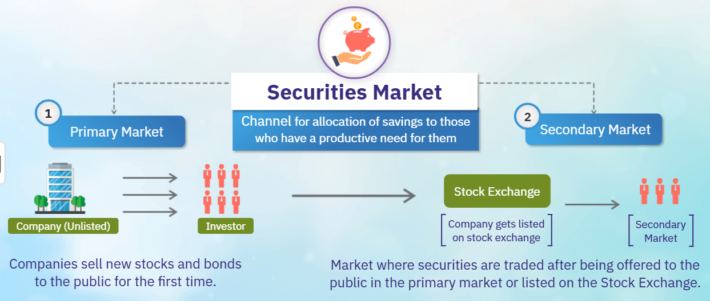
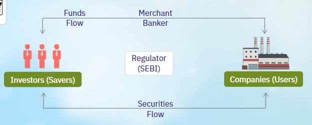

# Agenda
1. Primary and secondary markets
1. Key indicators of securities markets
1. Products traded in securities markets
1. Participants of securities markets
1. Various market segments and products
1. Reforms in Indian securities markets

## Security Market
It is a channel for allocation savings to those who have a productive need for them. It has two markets
1. Primary Market
1. Secondary Market

Here is an illustration of the same.

### Primary Market
Companies sell new stocks and bonds to the public for the first time. When companies wants to raise funds they issue **securities** to the **investors** who are the savers with the help of **merchant bankers**. Investors provide fund to the company through these bankers. All operations are governed and regualted by **SEBI** (Security and Exchange Board of India).

Here is a picturial representation of these events.

It provides an opportunity to issuer of securities both government and corporations raise resources to meet their requirements of investment.

Securities in the form of equity or debt can be issued in **Internation/Domestic markets** at **face value**, **discount** or **premium**.

Primary market issuance is done through **public issues** or **private placements**.

As per **Company Act 2013**, issue is referred as public if results in allotment of securities to **50 or more investors**.

### Secondary market
Market where securities are traded after being offered to the public in the primary market or listed on the Stock Exchange.