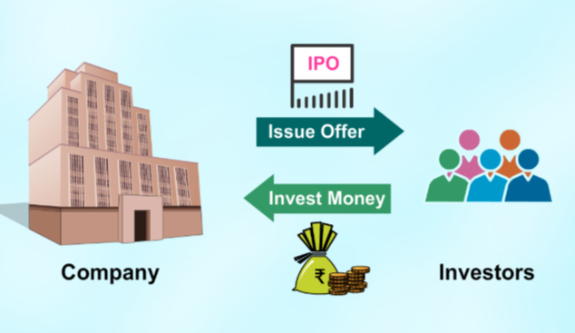
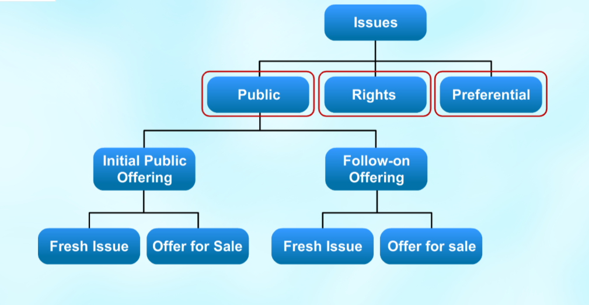

You will understand about
1. Primary Market
1. Various types of issues of securities
1. Initial Public Offering (IPO)

## Primary Market
The primary market provides the channel for sale of new securities. It provides the opportunity to issuers of securities, both government and corporate company, to raise resources to meet their requirements.

### Shares
Shares are an indivisible unit of a company's capital. Primary market issues the securities at face value, or at a discount/premium.

### Face Value
It is the nominal or stated amount in ruppees assigned to a security by the issuer. It is the original cost of stock shown on the certificate for shares. For bonds, it is the amount paid to the holder at maturity.

Equity shares face value is usually a small number like Rs.5/ or Rs.10/. It does not have much barring on price of share which may quote higher in the market like Rs.100/ or Rs.1000 or any other price that the market decides.

The face value of debt security for government and corporate is usually Rs.100. The price at which it is traded will depend on the fluctuation of interest rate.

## Discount and Premium
Securities are generally issued in denominations of Rs.5/, Rs.10/ or Rs.100/. This is known as the
Face Value or Par Value of the security. When a security is sold above its face value, it is said
to be issued at a Premium and if it is sold at less than its face value, then it is said to be issued at a Discount. Normally, issues are made at premium. Discount issues are rarely made.

## IPO
Most companies are started privately by their promoter or promoters. However, the promoter's capital and the borrowing from banks and financial institutions may not be sufficient for setting up or running the business in long term especially when the business grows and looks to expand.

**Key points**:
Companies invite the public to contribute towards the equity and issue shares to individual investors.

The way to invite share capital from public is through a public issue. Simply put, a public issue is a offer to the public to subscribe to the share capital of a company. Once this is done the company allots share to the applicant as per the prescribed rules and regulations laid down by SEBI.

### Issues
Primarily, issues are classified as
* Public
* Rights
* Prefrential or Private placements

Here is the structure of above issues.

Public and rights issue involve detailed procedure. Whereas procedure of preferential or private placements are relatively simpler.

#### Public
Public issues can be of two types.
* Initial Public Offering (IPO)
* Follow-on Offering

##### Initial Public Offering (IPO)
Initial Public Offering (IPO) is offered by an unlisted company, for the first time, in the form of
1. fresh issue of securities
1. offer for sale of existing securities

This paves the way for listing and trading of the Issuer's securities.

##### Follow-on Offering (FPO)
Follow-on Offering (FPO) is offered by an already listed company as:
* fresh sale
* offer for sale

**Fresh Sale** is also known as **Dilutive** as this increases the no of share in the market. **OFS** on the other hand is also known as "Non Dilutive** as the existing big share holders like director offer their share for sale to the public.

#### Rights
Rights issue is offered by a listed company as proposal of issuing fresh securities to its existing shareholders as on a record date. The rights are normally offered on a particula ratio to the no of securities held prior to the issue. For example a rights issue in the ratio 1:1 will double the no of share held by existing share holders. This route is best suited for companies try to raise capital without diluting the stake of existing share holders.

#### Preferential
It is an issue of shared or of convertible securities by listed companies to a select group of persons under 62 of Companies Act 2013. This is a faster way to raise equity capital. The issuer company has to comply with the Company Act and the requirements in chapter pertaining to prefential allotment under SEBI guidelines which inter alia include disclosure, pricing, notice etc.

Going for primary market issue, a company has to decide the issue price and calculate it's market capitalisation.

### Issue Price
**Issue Price** is the price at which a company's shares are offered initially in the Primary market. During the trade of the issues, the market price may be above or below the issue price. Investors can follow trades of public issues on the NSE website to check for market price.

### Market Capitalisation
Market Capitalisation = Current Share Price * No of Shares in the Market

### Difference Between Public Issues and Private Placements
When an issue is offered not only to select people but to the general public at large then it is a Public Issue. By Definition, a Public Issue is an issue when it is offered to 50 or more investors.

On the other hand Private Placements are offered to select set of people. By definition Private Placement is an issue that is offered to less than 50 investors excluding qualified institutions and employee stock option.

### Issue Price
Since 1992, Indian primary market enjoys the benefits of free pricing. The issuer can determine the price in consultation with primary merchant banker. Also, there is no price formula stipulated by SEBI. However, the issuer and merchant banker should give a full disclosure of all the parameters considered for arriving at the issue price.

There are two types of issue.
1. Company and Lead Merchant Banker fix a price, called fixed price
1. The company and the Lead Manager stipulate a floor price or a price band and leave it to the market forces to determine the final price

The above second process is called **Book Building**. Nowadays, all issues are normally done through the book built route. However, the fixed price route has been kept open to allow small and medium enterprises to offer shares on the Small and Medium Enterprise platform of the exchanges.

#### Price Discovery through Book Building Process
Book Building is basically a process used in IPOs for efficient price discovery. It is a mechanism
where, during the period for which the IPO is open, bids are collected from investors at
various prices, which are above or equal to the floor price. The offer price is determined after
the bid closing date.

#### Key Aspects of Book Building Process
In a Book building issue, the issuer is required to indicate either the price band or a floor price in the prospectus.

The actual discovered issue price can be any price in the price band or any price above the floor price. This issue price is called **Cut-Off Price**.

The issuer and lead manager decides this after considering the book and the investors' appetite for the stock.

**Floor price** is the minimum price at which bids can be made.

The prospectus may contain either the floor price for the securities or a **price band** within which the investors can bid. The spread between the floor and the cap of the price band shall not be more than 20%. In other words, it means that the cap should not be more than 120% of the floor price.

The price band can have a revision and such a revision in the price band shall be widely disseminated by informing the stock exchanges, by issuing a press release and also indicating the change on the relevant website and the terminals of the trading members participating in the book building process.

In case the price band is revised, the bidding period shall be extended for a further period of three days, subject to the total bidding period, not exceeding ten days.

The company itself decides on the price or the price band, in consultation with Merchant Bankers. The minimum no of days for which the bid should remain open is 3 days. Individual investor can use the book building facility to make an application.

How will the investor know whether the shares are alloted to them in an IPO or offer for sale?
As per SEBI, within 4 days of closing of the issue, the basis for allotment should be completed. Within in next 1 days of the completion of the basis for allotment, the details of credit to DEMAT Account or Allotment Advise or dispatch of refund order need to be completed. So, investor should know within 5 working days for closure of the issue whether shares are alloted to him or not.

How long does it take to get the shares listed after issue?
It takes 6 working days after the closure of the book built issue.

### Application Supported by Blocked Amount (ASBA)
ASBA is an application containing an authorization to block the application money in the bank account for subscribing to an issue. If an investor is applying through ASBA then his application money shall be debited from investors' bank account only if his application is selected for allotment after the basis of allotment is finalised or the issue is with drawn or failed.

Investors can apply in any public or rights issue by using their bank account. Investors submit the ASBA form available at the designated brances of the banks acting as Self Certified Syndicated Banks (SCSBs).

Submissions are done by filling the details like name of the applicant, PAN number, DEMAT account number, bid quantity, bid price and other relevant details to their banking branch.

An instruction to block the amount in their bank account to the bank is given. In turn the bank will upload the details in the bidding platform. Investors should ensure that the details filled in the form is correct. Otherwise, the application is liable to be rejected. From 1st January 2016, it is mandatory that all public issues are subscribed through ASBA only.

### Role of Registrar
The registrar finalises the list of allottees after removing invalid applications. It ensures that the corporate actions for crediting of shares to the DEMAT account of the applicant is done and dispatch of refund orders to those applicant are sent. The lead manager coordinates with registrar to ensure follow up so that the flow of applications from collecting bank branches, processing of the applications and other matters till the basis of allotment is finalized, dispatch of security certificates and refund orders completed and securities listed.
