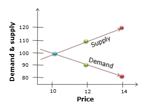
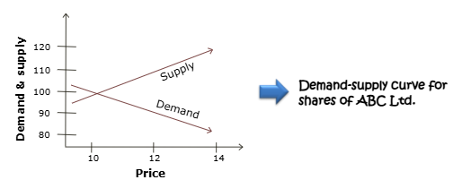
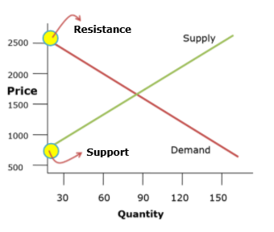
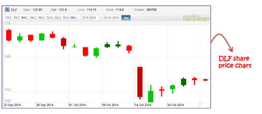
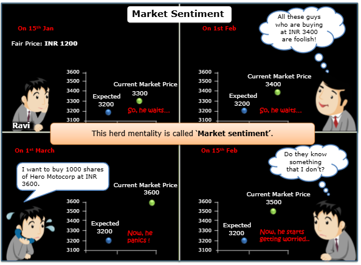
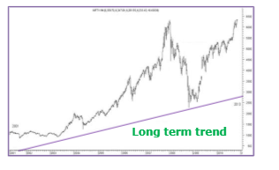
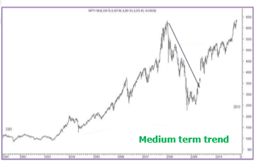
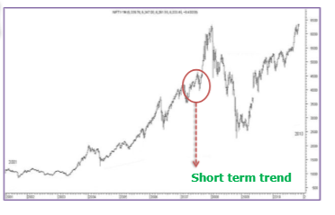
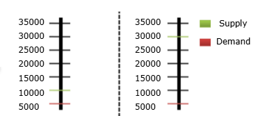
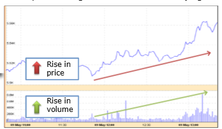

# Introduction to Technical Analysis
## Introduction
As market enthusiast, you might have heard about term like "Nifty is set to test 200 DMA". In news bits, you may see the price target of a stock. You may also come across snippet like Nifty is forming a "Bearish Belt Hold". These are the terms that are part of technical analysis.

## Why Analysis?
Most retail investors today do not use proper trading strategies before taking a buy/sell decision, as they feel equity trading is pure gambling and nothing else.

If you wish to buy a TV, you visit 10 different shops, evaluate the different features like brand, price, size, warranty and come to a decision. So, why not treat stock trading the same way, where there is a risk of actual financial loss.

It is thus essential to perform a scientific analysis, before making a trading decision.

## Why do markets move?
Basics of micro-economics state that market price of a commodity or asset is based on forces of **demand and supply**.

For example, in a stock market:
If more people want to buy the stock than sell it. Demand is higher than supply. So, price of stock moves up.

If more people want to sell the stock than buy it. Supply is higher than demand. So, price of stock falls.

### Demand-Supply Curve
Let's understand the demand-supply mechanism with the help of an example.
Data of buy and sell quantity for shares of ABC Ltd. at various prices, is given below.

| Price (INR) | Supply (in units) | Demand (in units) |
| ----------- | ----------------- | ----------------- |
| 14 | 120 | 80 |
| 12 | 110 | 90 |
| 10 | 100 | 100 |

The demand line shows the number of buyers willing to buy at a given price. As the price increases, the number of buyers willing to buy at these higher prices decreases.

The supply line shows the number of suppliers willing to sell at a given price. As the price increases, the number of sellers willing to sell at these higher prices increases.

### Equilibrium Price
At a price called the **equilibrium price**, the volume of demand for an asset will equal the supply for the asset.

Which of the below will be the equilibrium price for shares of ABC Ltd. from above demand-supply curve?
a. 10
b. 12
c. 14

### Support and Resistance
**Resistance** occurs where the price reaches a point, where there are no buyers willing to buy at that price.

Similarly, **Support** occurs on the left side of the supply line, at a point where sellers are no longer willing to sell at that price.

The position of these lines changes continually during market action. This reflects the changing opinions and expectations of investors.

### Momentum
We mentioned, that stock prices move based on demand & supply forces. These forces in market jargon is defined as **momentum**.

Momentum of a stock is influenced by:
* Fundamental Factors
* Technical Factors

## Fundamental Factors
Fundamentals of a company is the basic driving force of a stock price. It relates to factors like:
* Profit generated by the company
* Volume of sales
* Availability of cash etc.

External events like:
* Government policy changes
* Global crises (Like war)
* Commodity prices etc.

The magnitude of the change in price depends upon the market's analysis of the impact, these factors can make to the company's top line and bottom line.

**Top line** refers to the sales. **Bottom line** refers to the profits.

Let us look at a live example to illustrate how these factors impact the stock price of a company.

SEBI has barred DLF Ltd. from tapping capital markets for three years. The stock price fell to its 52 week low of INR 100 from INR 145.

Analysis of these factors, is termed **Fundamental Analysis** in market parlance.

## Fundamental Analysis
Fundamental Analysis is the process of evaluating a stock taking into consideration the following factors:
1. External macro-economic factors: Like the overall economy & industry factors
2. Company specific factors: Like the financial performance and health of the company

A fundamental analyst takes into consideration both the qualitative & quantitative aspects for analysis.

### Quantitative aspects
The quantitative aspects revolve around the financial statements of the company. It involves:
* Income
* Expenses
* Assets
* Liabilities &
* All other financial aspects related to the company

### Qualitative aspects
The qualitative aspects on the other hand are the less tangible factors such as:
* Brand name of the company
* Competitive advantages
* Quality of management etc.

### EIC framework or Top-Down approach
A fundamental analyst would follow a 3 stage process:
1. Analyse the Economy.
2. Analyse the Industry.
3. Analyse the Company.

It is also called the EIC framework, and in market jargon a Top-Down approach to investing. E stands for Economy. I stands for Industry. C stands for Company.

In this approach (EIC) first the economy, then Intdustry and finally the company is selected.

For example, if the economy is recovering from a recession, what could be the best investment?
In this scenario one might like to invest in companies related to house building activities - cement, steel and construction companies. An investor will then consider which companies among these sectors hold out the best prospects for growth.

### Bottom-up approach
A fundamental analyst may also follow a 'Bottom-up' approach. It involves analyzing a company purely based on its own fundamentals, irrespective of the state of the industry and economy. This approach assumes that a company with solid fundamentals will perform well even when the market is unfavorable.

## Market Sentiment
Often, markets move, purely based on investor sentiment. By sentiment, we simply mean the prevailing mood of the market.

You might have observed that despite very good results, the stock price of a company decreases, and vice versa.

RIM woes in spotlight despite robust results
Shares in "Research In Motion" ended almost flat on Friday as robust results were mostly overlooked and analysts stuck to pessimistic views on the product BlackBerry.

Let us understand how market sentiment works in practice.

Let's take an example of Ravi, who wants to buy 1000 shares of Hero Moto corp at Rs. 3200 while the current market price is Rs. 3300 on 15th Jan. So, he waits. On 1st of Feb current market price moves upward to 3400. Ravi thinks all these guys who are buying at 3400 are foolish!. So, he waits again. A couple weeks down the line on 15th Feb the current market price moves further upto Rs. 3500. He starts to wonder and asks himself "Do they know something that I don't?". Now, he starts getting worried. First forward to two weeks on 1st of March, current market price further goes upto Rs. 3600. And now, he panics. He quickly picks up the phone to his broker and places an order at Rs. 3600. This herd mentality is called **Market sentiment**.

### Factors Affecting Market Sentiments
Some of the factors that affect this sentiment are:
#### Performance of global markets
If global markets (US, Europe, Rest of Asia) are in negative territory, most of the times Indian markets would follow the same trend.

#### Liquidity Situation
Let's understand this by looking at what happened in 2014. In 2014, with the tapering of Quantitative Easing (QE) in the United States, some foreign funds were flowing out of Emerging Markets like India.

The Federal Reserve announced tapering of QE as growth of the US economy was looking stable.

##### Quantitative Easing
You can better understand **Quantitative Easing** by looking at what happened in 2008, the global financial crisis, also populalrly known as sub-prime crisis. In order to revive the economy, the US federal reserve took up the initiative of quatitive easing. It's a moneytary policy of infusing liquidity into the system by creating new money. The newly created money was ultimately utilised for buying financial assets like bonds and corporate debts by financial institutions in the country. So, the money moved from central bank in the form of new money into the economy. And the US citizens were able to buy financial assets from the US banks and in turn financial institutions of that country were able buy finacial assets and infuse liquidity into emerging markets like Indian economy.

**Quantitative easing** was the US Fed monetary policy of infusing liquidity into the system by creating 'new money'. The newly created money is ultimately utilized for buying financial assets like bonds & corporate debt from financial institutions in the country.

As QE fears abated, Indian stock markets hit record highs in October 2014, despite analysts calling the markets overvalued. FIIs continued to pump in money, as economic outlook in the rest of the world, including China, was soft. In market jargon, it was called a rally driven by liquidity, rather than Fundamentals.

If this were the case, fundamental analysis will tend to have its limitations, as it analyses what we know the IQ - intelligent quotient of the market, and not the EQ -Emotional quotient of the market. Hence, another school of thought called 'Technical Analysis' came into being.

## Technical Analysis
Technical analysis by definition, is determining stock trends based purely on historical price movements, and not on fundamentals. The basic premise of technical analysis is that:
1. Investor behaviour will be repeated over time
2. All market factors good or bad, are already reflected in the market price of a stock.

**Important:**
Hence, a technical analyst looks at market price and nothing else.

In practice, technical analysis is done by plotting usually the closing prices of a stock or index on a chart, and identifying different patterns, and technical indicators for the stock. These patterns and indicators help determine the future trend of the stock.

Technical analysts are also called chartists for the same reason.

### Seimens - Buy
LTP: Rs 758
Target: Rs 933
Since 2013 this counter is moving in a well-defined ascending channel with multiple touch points. Hence, if the stock sustains above Rs 700 levels, a decent target of Rs 933 can't be ruled out in this counter over a period of time.
### Bank of Baroda - Buy
LTP: Rs 111.70 Target: Rs 150 Investors should accumulate this counter between 110 90 kind of levels. In case it stabilizes and rallies eventually it should test its interim top placed at 150 levels. A stop suggested for the trade is a close below Rs 80.

### Mahindra & Mahindra - Buy
LTP: Rs 758 Target: Rs 933 Since 2013 this counter is moving in a well-defined ascending channel with multiple touch points. Investors should accumulate this counter between 730 700 kind of levels. A stop suggested for the trade is a close below Rs 685.

This is a report given by a Technical analyst from Chartview India, where he has shared his technical views on different stocks, and why he feels the stocks should move in a particular direction. This is a regular column in the Money Control market page. We shall decode the jargon mentioned in the article as we go along.

## Difference between Technical and Fundamental Analysis:
| Parameter | Fundamental Analysis | Technical Analysis |
| --------- | -------------------- | ------------------ |
| Horizon | A fundamental analyst looks into the balance sheet or the profitability of the business. The view here is typically long term in nature. | The Technical Analyst is more concerned about the current momentum in a particular stock. The view here is typically short term. | 
| Basis | Fundamental analysis is based purely on fundamentals of the stock. | Technical analysis is based purely on investor behavior. |

Infosys for example: If past behavior suggests that Infosys must be sold whenever it comes close to INR 700, the pure technical analyst will do so, even if Infosys posts better than expected results.

## Which is better approach?
Although fundamental & technical analysis are viewed as polar opposites, combining the two can lead to better results. An ideal investment decision should be backed by both the analysis.

**Important:**
Hence a fundamental analyst cannot ignore technical factors affecting stock movements.
Similarly, a technical analyst cannot afford to ignore the fundamental factors affecting a stock.

## Charles Dow Theories
### Interesting Facts
* Charles Dow known as the FATHER of Technical Analysis, was an American journalist.
* He founded The Wall Street Journal, which has become one of the most respected financial publications in the world.
* He profounded the Dow Theory, which became the basis of the Modern Technical Analysis which we use today.
* He invented the Dow Jones Industrial Average, the benchmark stock index in the U.S, as part of his research into market movements.

### Chart Studies Theory
There are three important theories
* Market has three movements
* Market immediately discounts information
* Trends are confirmed by volume

#### Market has three movements
1. The main movement, primary movement or major trend.

This may last from less than a year to several years. It can be bullish or bearish. It represents the broad underlying trend in the market. Success of a chartist is his/her ability to spot the primary movement and stay with it.

2. The medium swing, secondary movement, intermediate reaction

This may last from ten days to three months, is reactive in nature, and is contrary to the primary trend i.e. a correction in a bull market or a rally in a bear market. According to Dow, this movement generally retraces 33% to 66% of the primary price change, with 50% being the most probable. Also, secondary moves tend to be faster and sharper than the preceding primary move.

3. The short swing or minor movement varies with opinion, from hours to a month or more.

It is important for a trader to identify a movement as a primary or secondary movement.
This will define whether you are in the broad confines of a bull or bear market.

Secondly, as the secondary movement is more unpredictable in terms of time, it requires a more detailed analysis.

**<u>For example:</u>**

* Is this a secondary trend or a start of a new
primary trend?
* How far does a secondary move have to go before the primary trend is affected?

These are judgements based on experience.

#### Market immediately discounts information
This premise states that all public information related to a stock is discounted or reflected in the market price.

**<u>REUTERS</u>**

Infosys results spell trouble for sector, shares fall 9 pct. Infosys Technologies Ltd, India's No. 2 software services exporter, sparked worries about the sector's growth after it estimated annual sales lower than consensus as client spending slowed, knocking its shares down more than 9%

For example: If Infosys is not doing well, the Infosys stock has already gone down. There is no point in analyzing this information again. All an analyst needs to look at is market price, and identify trends based on these prices.

#### Trends are confirmed by volume
Dow believed that volume confirmed price trends. When prices move on low volume, there could be many different explanations why. An overly aggressive seller could be present for example. But when price movements are accompanied by high volume, Dow believed this represented the 'true' market view.

Supply exceeds demand by 5000 units, may not be a trend. Supply exceeds demand by 25000 units, indicates a trend.

If many participants are active in a particular security, and the price moves significantly in one direction, Dow maintained that this was the direction in which the market anticipated continued movement.

**To him, it was a signal that a trend is developing.**

