# Preparation of Technical Charts

## What is Technical Chart?
A basic chart displays price movements with respect to time. 'Prices' usually imply closing prices for that period.

For example, daily charts will plot the daily closing prices for a stock or index.

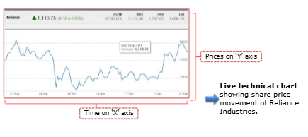

### Illustration - Plotting a Chart
Let's try plotting a chart for Tata Motors shares. What information do we need?

| Date | Close Price |
| ---- | ----------- |
| 06-Feb-19 | 178.50 |
| 07-Feb-19 | 182.85 |
| 08-Feb-19 | 150.70 |
| 11-Feb-19 | 152.65 |
| 12-Feb-19 | 151.80 |

You can get prices for stocks and Indices by visiting the following link:
https://www.nseindia.com/live_market/dynaContent/live_watch/get_quote/GetQuote.jsp/symbol-TATAMOTOR

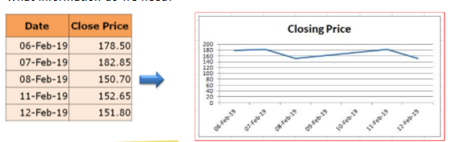

## Why are Charts Used?
The value of a chart is, that it can tell us at a glance how a stock or index has performed over any period of time.

An example of the NIFTY index is shown below to illustrate this.

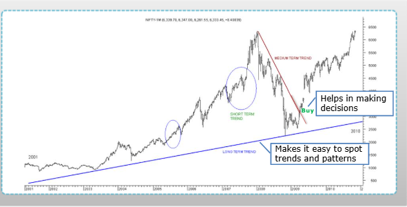

* Helps in making buy decisions
* Makes it easy to spot trends and patterns

## Plotting a Chart
Technical charts are plotted on three basic parameters.
* Price on 'Y' axis
* Time on 'X' axis
* Volume in volume panel

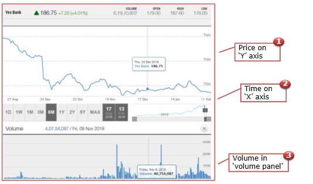

Certain types of chart require other information like
* Open Price
* High Price
* Low Price
* Close Price

| Date | Symbol | Series | Open | High | Low | LTP | Close | Volume | Turnover (in Lakhs) |
| ---- | ------ | ------ | ---- | ---- | --- | --- | ----- | ------ | ------------------- |
| 13-Feb-2019 | | YESBANK | EQ | 173.99 | 174.70 | 168.10 | 168.70 | 169.43 | 2,62,29,114 | 44,881.43 |
| 12-Feb-2019 | YESBANK | EQ | 172.00 | 176.25 | 172.10 | 172.65 | 172.65 | 2,22.96.518 | 38,893.27 |
| 11-Feb-2019 | YETBANK | EQ | 175.10 | 176.00 | 170.10 | 173.00 | 173.25 | 2,95,09,227 | 351,023.40 |
| 08-Feb-2019 | YESBANK | EQ | 177.00 | 176.30 | 173.25 | 175.10 | 175.10 | 2,25,61,739 | 57,294.15 |
| 07-Feb-2018 | YESBANK | EQ | 177.10 | 181.00 | 175.25 | 177.05 | 176.95 | 4,44,94,971 | 79,635.26 |

The **first trade** of YesBank shares on 13th Feb. was INR 173.95
The **highest price** at which YesBank shares were traded on 7th Feb was INR 181.80
The **lowest price** at which YesBank shares were traded on 11th Feb was INR 170.10
The **closing price** of Yes Bank shares on 13th Feb was INR 169.45

This is popularly referred as **OHLC**.

### Plotting Chart by Time
Time is plotted on X axis. All technical charts are made with respect to time, though there can be different time periods depending on the scope and horizon of analysis.

**<u>End of Day (EOD) chart</u>**
These are charts that plot the daily closing prices for a stock or index.
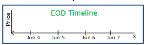

**<u>Intraday chart</u>**
It's a continuous tick chart that represents the trading of that day (hourly or tick by tick). This chart is used by short term traders.
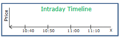

**<u>Weekly/Monthly charts</u>**
This is a chart which represents the weekly/monthly closing prices for a stock or index. This is generally used in tandem with the daily charts, to view the short and medium term trends. It may happen that a stock is bullish on the daily charts, but bearish on the weekly charts.
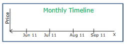

### Plotting Chart by Volume
It is plotted in volume panel. Technical analysts also use the volumes traded for a particular stock, at a price, as an important determinant for trend analysis. Volume panel is plotted just below the share price panel and shows the daily volume.
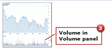

You can see that the volume is plotted along the stock price, and corresponds equally with time period and traded quantity.
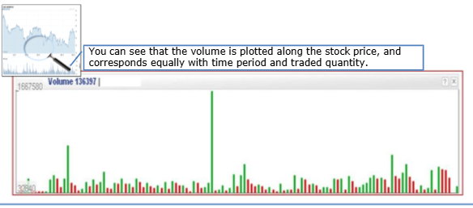

Trading volume is the primary indicator of supply and demand. If the price is rising with heavy volume, the rise is likely to continue. If that same rising price is with declining volume, the rise is not likely to continue.

An interesting fact about the price-volume chart is that:
* In an Uptrend, volume increase will lead a price rise.
* In a Downtrend, volume increase will lead a fall in prices.

**<u>Important:</u>**
Hence, a price movement in a particular direction must be supported by higher volume for the trend to continue. If volumes do not support a price trend, the trend is most likely to reverse.

Analyst must look at price movements in conjunction with volume of turnover, to determine trends. This is what Charles Dow also said, remember **trends are confirmed by volume**.

An example of the Nifty is given below to illustrate this.
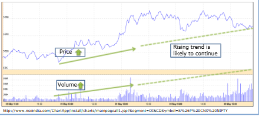

### Illustration - Plotting a Price-Volume Char
Let's now plot a price-volume chart for Tata Motors. What information do we need?
| Date | Closing Price | Volume |
| ---- | ------------- | ------ |
| 06-Feb-19 | 178.50 | 1,03,34,594 |
| 07-Feb-19 | 182.85 | | 1,61,52,722 |
| 08-Feb-19 | 150.70 | | 10,22,56,857 |
| 11-Feb-19 | 152.65 | 2,61,61,867 |
| 12-Feb-19 | 151.80 | 1,41,74,912 |

You can get the data for stocks and indices by visiting the following link: http://www.nseindia.com/content/equities/eq_historicaldata.htm

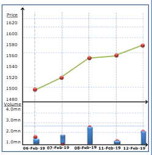

## Types of Charts
Analysts use different kinds of charts, depending on the scope and horizon of research. All the charts have different attributes and can be used independently or in conjunction, to arrive at a decision. Have you come across various types of charts and wondered what they signify? Let's identify and understand different types of charts used by technical analysts.

There are four popular type of chars
* Line Chart
* Bar Chart
* Candlestick Chart
* Point & Figure Chart

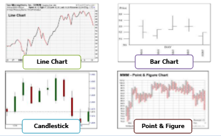

### Line Chart
To create a line chart, the daily closing prices for a stock is plotted over time and then connected by a continuous line. You may recall, we have shown a line chart earlier fom Tata Motors.

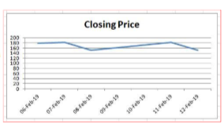

#### Advantages of Line chart
* Line chart is the simplest and the most basic chart
* It is easy to plot, and hence commonly used
* Spotting a trend is easy on the line chart

### Bar Chart
A bar chart, also known as OHLC chart, is drawn using the Open, High, Low and Close of a stock.

To plot a bar chart, we need to understand how four prices (Open, High, Low, Close) are plotted and the bar is formed. Let's plot a bar for XYZ ltd. to understand it better. 

| Date | Open | High | Low | Close |
| ---- | ---- | ---- | --- | ----- |
| 10th May | 8.25 | 9.75 | 8.00 | 9.50 |

First you need to plot 4 different prices on the graph on the same day i.e 10th of May. You need to then connect high with low which becomes a vertical line. And the other two points the open and close you need to follow below steps. For open point draw a left tick (left horizontal bar). For close point draw a right tick (right horizontal bar).

The High and Low show fluctation in price intraday. 