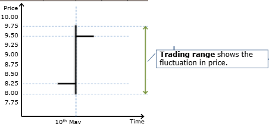
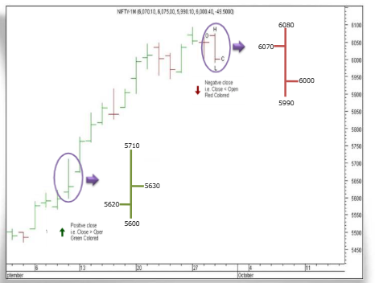
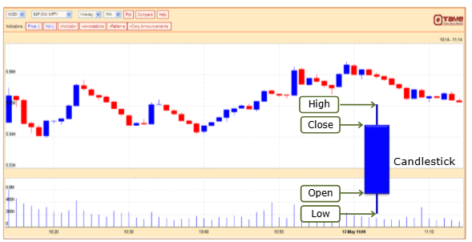
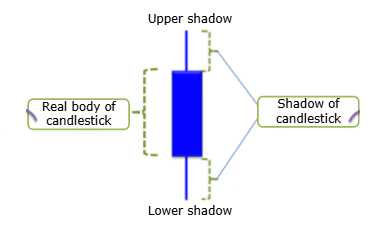
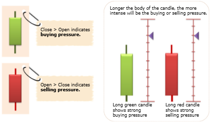
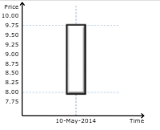
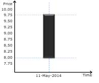

# Preparation of Technical Charts

## What is Technical Chart?
A basic chart displays price movements with respect to time. 'Prices' usually imply closing prices for that period.

For example, daily charts will plot the daily closing prices for a stock or index.

### Illustration - Plotting a Chart
Let's try plotting a chart for Tata Motors shares. What information do we need?

| Date | Close Price |
| ---- | ----------- |
| 06-Feb-19 | 178.50 |
| 07-Feb-19 | 182.85 |
| 08-Feb-19 | 150.70 |
| 11-Feb-19 | 152.65 |
| 12-Feb-19 | 151.80 |

You can get prices for stocks and Indices by visiting the following link:
https://www.nseindia.com/live_market/dynaContent/live_watch/get_quote/GetQuote.jsp/symbol-TATAMOTOR

## Why are Charts Used?
The value of a chart is, that it can tell us at a glance how a stock or index has performed over any period of time.

An example of the NIFTY index is shown below to illustrate this.

* Helps in making buy decisions
* Makes it easy to spot trends and patterns

## Plotting a Chart
Technical charts are plotted on three basic parameters.
* Price on 'Y' axis
* Time on 'X' axis
* Volume in volume panel

Certain types of chart require other information like
* Open Price
* High Price
* Low Price
* Close Price

| Date | Symbol | Series | Open | High | Low | LTP | Close | Volume | Turnover (in Lakhs) |
| ---- | ------ | ------ | ---- | ---- | --- | --- | ----- | ------ | ------------------- |
| 13-Feb-2019 | YESBANK | EQ | 173.99 | 174.70 | 168.10 | 168.70 | 169.43 | 2,62,29,114 | 44,881.43 |
| 12-Feb-2019 | YESBANK | EQ | 172.00 | 176.25 | 172.10 | 172.65 | 172.65 | 2,22.96.518 | 38,893.27 |
| 11-Feb-2019 | YETBANK | EQ | 175.10 | 176.00 | 170.10 | 173.00 | 173.25 | 2,95,09,227 | 351,023.40 |
| 08-Feb-2019 | YESBANK | EQ | 177.00 | 176.30 | 173.25 | 175.10 | 175.10 | 2,25,61,739 | 57,294.15 |
| 07-Feb-2018 | YESBANK | EQ | 177.10 | 181.00 | 175.25 | 177.05 | 176.95 | 4,44,94,971 | 79,635.26 |

The **first trade** of YesBank shares on 13th Feb. was INR 173.95
The **highest price** at which YesBank shares were traded on 7th Feb was INR 181.80
The **lowest price** at which YesBank shares were traded on 11th Feb was INR 170.10
The **closing price** of Yes Bank shares on 13th Feb was INR 169.45

This is popularly referred as **OHLC**.

### Plotting Chart by Time
Time is plotted on X axis. All technical charts are made with respect to time, though there can be different time periods depending on the scope and horizon of analysis.

**<u>End of Day (EOD) chart</u>**
These are charts that plot the daily closing prices for a stock or index.

**<u>Intraday chart</u>**
It's a continuous tick chart that represents the trading of that day (hourly or tick by tick). This chart is used by short term traders.

**<u>Weekly/Monthly charts</u>**
This is a chart which represents the weekly/monthly closing prices for a stock or index. This is generally used in tandem with the daily charts, to view the short and medium term trends. It may happen that a stock is bullish on the daily charts, but bearish on the weekly charts.

### Plotting Chart by Volume
It is plotted in volume panel. Technical analysts also use the volumes traded for a particular stock, at a price, as an important determinant for trend analysis. Volume panel is plotted just below the share price panel and shows the daily volume.

You can see that the volume is plotted along the stock price, and corresponds equally with time period and traded quantity.

Trading volume is the primary indicator of supply and demand. If the price is rising with heavy volume, the rise is likely to continue. If that same rising price is with declining volume, the rise is not likely to continue.

An interesting fact about the price-volume chart is that:
* In an Uptrend, volume increase will lead a price rise.
* In a Downtrend, volume increase will lead a fall in prices.

**<u>Important:</u>**
Hence, a price movement in a particular direction must be supported by higher volume for the trend to continue. If volumes do not support a price trend, the trend is most likely to reverse.

Analyst must look at price movements in conjunction with volume of turnover, to determine trends. This is what Charles Dow also said, remember **trends are confirmed by volume**.

An example of the Nifty is given below to illustrate this.

### Illustration - Plotting a Price-Volume Char
Let's now plot a price-volume chart for Tata Motors. What information do we need?
| Date | Closing Price | Volume |
| ---- | ------------- | ------ |
| 06-Feb-19 | 178.50 | 1,03,34,594 |
| 07-Feb-19 | 182.85 | 1,61,52,722 |
| 08-Feb-19 | 150.70 | 10,22,56,857 |
| 11-Feb-19 | 152.65 | 2,61,61,867 |
| 12-Feb-19 | 151.80 | 1,41,74,912 |

You can get the data for stocks and indices by visiting the following link: http://www.nseindia.com/content/equities/eq_historicaldata.htm

## Types of Charts
Analysts use different kinds of charts, depending on the scope and horizon of research. All the charts have different attributes and can be used independently or in conjunction, to arrive at a decision. Have you come across various types of charts and wondered what they signify? Let's identify and understand different types of charts used by technical analysts.

There are four popular type of chars
* Line Chart
* Bar Chart
* Candlestick Chart
* Point & Figure Chart

### Line Chart
To create a line chart, the daily closing prices for a stock is plotted over time and then connected by a continuous line. You may recall, we have shown a line chart earlier fom Tata Motors.

#### Advantages of Line chart
* Line chart is the simplest and the most basic chart
* It is easy to plot, and hence commonly used
* Spotting a trend is easy on the line chart

### Bar Chart
A bar chart, also known as OHLC chart, is drawn using the Open, High, Low and Close of a stock.

#### Plotting Bar Chart
To plot a bar chart, we need to understand how four prices (Open, High, Low, Close) are plotted and the bar is formed. Let's plot a bar for XYZ ltd. to understand it better. 

| Date | Open | High | Low | Close |
| ---- | ---- | ---- | --- | ----- |
| 10th May | 8.25 | 9.75 | 8.00 | 9.50 |

First you need to plot 4 different prices on the graph on the same day i.e 10th of May. You need to then connect high with low which becomes a vertical line. And the other two points the open and close you need to follow below steps. For open point draw a left tick (left horizontal bar). For close point draw a right tick (right horizontal bar).

Trading range shows the fluctuation in price. The High and Low show fluctuation in price intraday. If High-Low is a longer vertical line that means the price fluctuated widely during the day. If High-Low is a shorter vertical line then the price was stable during the day.

When left tick is lower than right tic, it implies that Closing price > Opening price = rise in price in intraday trade. The bar would be colored green/blue in this case.

When right tic is lower than left tic, it implies that Opening price > Closing price = fall in price in intraday trade. The bar would be colored red/black in this case.

A sample bar chart of NIFTY, with different colors, is given below.

**Advantage**: The advantage of a bar chart is that it shows all the relevant trading points i.e. open, high, low and closing for that trading period, making the research more meaningful.

### Candlestick Chart
This charting technique, also known as the **Japanese candlestick**, is a mix of the line and bar chart. This also shows the Open, High, Low and Closing prices, but in the form of a candle.

A candlestick is divided into 2 parts: real body and the shadow.

The part between the open and close on a candle is known as the real part or real body of the candle.

The outer wick shaped vertical lines which indicate the high and low of the Candle stick, are known as the upper and lower shadow respectively. The shadow is the portion of the trading range outside of the body.

#### Plotting Candlestick Chart
Let's draw a candlestick for XYZ Ltd. shares using below example.
| Date | Open | High | Low | Close |
| ---- | ---- | ---- | --- | ----- |
| 10th May | 8.25 | 9.75 | 8.00 | 9.50 |

First we need to plot Open, High, Low and Close prices. The gap between Open and Close must be filled with real body. On either side of the body extend the vertical line till High and Low. If Close price is higher than the Open price then the candlestick is plotted in green, blue, white or hollow. However, if Close price is lower thant the Open price then the candlestick is plotted in red or black.

**Advantages**: The colors makes it easy for the analyst to understand the trend. Compared to traditional bar charts, many traders consider candlestick charts more visually appealing and easier to interpret.

The relationship between the open and close is considered vital information and forms the essence of candlesticks.

Close > Open indicates buying pressure.

Longer the body of the candle, the more intense will be the buying or selling pressure.
Open > Close indicates selling pressure.

* Long green candle shows strong buying pressure
* Long red candle shows strong selling pressure

The more potent, longer candlesticks are called **Marubozu brothers**. 

#### Marubozu brothers
A green Marubozu forms when Opening price = Lowest price and Closing price = Highest price of the day. This indicates that buyers controlled the price action from the first trade to the last trade. It means that the market was driven by good buying through the day.

A red Marubozu forms when Opening price = Highest price and Closing price = Lowest price of the day. This indicates that sellers controlled the price action from the first trade to the last trade. It means that the market was driven by sellers through the day.

#### Doji
Conversely, a short candlestick indicate little price movement, and represents consolidation. This is also called a **Doji** formation.

The word doji comes from an ancient Japanese word that basically means knife.

A Doji represents the equilibrium between supply and demand, or a tie between bulls and bears in the markets. It marks the beginning of a minor or intermediate trend reversal, and is therefore very important to recognize.

This pattern emerges when prices open and close at or near the same level, indicating indecision of investors. It can be explained as.
* First the sellers drove the price lower
* Then the buyers drove the price up
* Next the sellers drove the price down again
* Markets end up at the same place where it started indicating indecisiveness

Short trading range signifies little price movement.

Doji can be of either color. It derives its color from the previous day's candle.

There are four types of Doji.
##### Common Doji
Short candlestick where opening price = closing price.

##### Long-legged Doji
Long upper and lower shadow that is almost equal in length. This signal indicates that prices traded well above and below the session's opening level, but the end result shows little change from the open.

##### Dragonfly Doji
Equal open, high, close.

First, sellers drove the prices lower. Buyers pushed the prices back to the opening level and the session high. This signals a reversal after a down-trend. Long lower shadow.

##### Gravestone Doji
Equal open, low, close

Buyers drove the prices higher. Sellers pushed the prices back to the opening level and the session low. This signals a reversal after an uptrend. Long upper shadow.

#### Engulfing patterns:
These are where the body of the second candlestick 'engulfs' the first (previous day's candlestick). Second candlestick completely engulfs the first.

The first candle is often a doji or gravestone. This pattern signal a reversal in the short-term trend.

This is a bullish signal on a down trend

This is a bearish signal on a up trend

#### Harami patterns:
Here, the second candlestick must be contained within the body of the first, though the shadows may protrude slightly. 

A Harami formation indicates loss of momentum and often warns of reversal after a strong trend. **Harami** in Japanese, means 'pregnant' which is quite descriptive.

Real body of green candlestick ending a row of red candlesticks is a bullish sign in a downtrend.

Real body of red candlestick ending a row of green candlesticks is a bearish sign in an uptrend.

### Point & Figure Chart
Point & Figure charts represent filtered price movements over time. These charts may look alien to the normal chart users. A Point and Figure chart plots day-to-day price movements without taking into consideration the passage of time. This is a very popular method of charting, especially amongst currency traders.

#### Creating a Point and Figure chart
##### Step 1: Determination of unit price
The first step is to define the extent of price movement that has to occur, before it is plotted on the chart. Rising prices are shown with X's, and falling prices are shown with O's. These Xs and Os appear on the chart only if the price moves by one unit in either direction i.e. up or down. (Up-X and Down - O)

#### Example
If the unit price movement defined is say 10 paisa, then only if price increases by 10p put X in column. Only if price decreases by 10p then put O in column.

Let us illustrate this with EUR/USD, though the same can be extended to any asset. The unit price movement defined is 10 pips. Pips stands for percentage in point. An 'X' will be marked on the chart in case the EUR/USD rate increases by 10 pips (1.2490 to 1.2500). An 'O' will be marked on the chart for a rate decrease of 10 pips (1.2550 to 1.2540).

| Price | | |
| ----- | - | - |
| 1.2550 |
| 1.2540 | | 0 |
| 1.2530 |
| 1.2520 | X | |
| 1.2510 | X | |
| 1,2500 | X | |
| 1.2490 | | |

So, if the current price of EUR/USD is 1.2490, and it moved up by 30 pips, it would appear as a column of three X's on the chart.

##### Step 2: Determination of Reversal Point
The next step is to determine, what is called the **Reversal Point** by how much should the price move in the opposite direction, for the chart to begin a new column, i.e.
If price is decreasing, then by how much should it increase, to begin a new column and put X.

If price is increasing, then by how much should it decrease, to begin a new column and put O.

**Continuing with our EUR/USD example:**
Let us say, the 'reversal' point is 50 pips. So, if EUR/USD has been trading upwards from 1.2540 to 1.2570, it would have to close at 1.2520, before the chart would reverse to a column of O's. Then, as each unit of price movement must be plotted, each 10 pip movement down from 1.2570 levels to 1.2520 will be marked in this new column of O's, and represented by one O.

#### Point & Figure Chart for stocks
The following table gives the high and low prices for a particular stock.
| Date | High | Low |
| ---- | ---- | --- |
| 10th Nov | 15.25 | 15.00 |
| 11th Nov | 15.25 | 14.75 |
| 12 Nov | 15.00 | 14.75 |
| 13 Nov | 14.75 | 14.50 |
| 16th Nov | 14.50 | 14.20 |
| 17th Nov | 14.50 | 14.00 |
| 18 Nov | 14.75 | 14.30 |
| 19 Nov | 14.75 | 14.50 |
| 20th Nov | 14.50 | 14.25 |
| 23 Nov | 14.50 | 14.25 |
| 24 Nov | 14.25 | 14.00 |
| 25th Nov | 14.25 | 14.00 |

First, the unit price movement should be decided. The unit price movement to be recorded is say 20 paisa, and the reversal point is 60 paisa.

Now, on 10th Nov, the stock showed an upward trend, with a high of 15.25 from 15.00. We mark an "X" in the column, for every 20 paisa movement. There is only one 'X' that falls on the 15.20 price point, as the share has not yet reached 15.40.

The 60 paisa reversal happens on 13th Nov with a low of 14.50. Let's try to understand. From high of 15.25 on 10th Nov the low is 14.75 on 11th Nov which is a decrease of 50 paisa. Which means it has not hit the 60 paisa reversal point. Similar is the case on 12th Nov as the low is 14.75 again. It is a decrease of 50 paisa and does not hit the reversal point of 60 paisa. However, on 13th Nov the decrease of 75 paisa compared to earlier decrease of 50 paisa qualifies for reversal point of 60 paisa. It indicates that the reversal has happened as 75 paisa is more than 60 paisa. We now plot series of O's from 15.00 till 14.40. 

An 'O' is not placed in the 14.20 row because the price has not yet reached 14.20. The price does, however, fall to 14.20 on 16th Nov and another "O' is place in the 14.20 row. The price falls once again to 14.00 on 17th Nov. When this occurs yet another 'o' is added to the chart, this time in the 14.00 row. The very next day the chart rises to 14.75, and this constitutes a reversal again.

The chart is moved to the next column and 'X's are placed in the 14.20, 14.40 and 14.60 rows.

After hitting 14.75 on 18th Nov the stock has not moved upward for the unit price movement of 20 paisa. Neither it has fallen below 60 paisa reversal point. However, on 24th Nov it drops to 14.00 which is a 75 paisa drop from the height of 14.75. It indicates another reversal. 3 O's are placed in the appropriate column to reflect this reversal. And life goes on in this fashion for the chartist.

The chart so far, would then look like this.

#### Rules of Plotting Point & Figure Chart
* Determine the unit price.
* Determine the reversal point.
* Put 'X' when price goes up by one unit.
* Put 'O' when price goes down by one unit.
* Move to next column if reversal point is crossed.

#### Reading Point & Figure Chart
Key Components in reading point and figure charts:
* Law of Supply and Demand
* Support Level
* Resistance Level

##### Law of Supply and Demand
We all know that the law of supply and demand determines the price of a stock. So in P&F jargon, if we have an uptrend in place with at least three X's, we believe that demand has overcome supply. The reverse is true, when the chart gives us three O's. That indicates supply has overcome demand.

##### Support Level
We mentioned earlier, that a support level is a level at which traders believe prices will start to move higher after hitting the support mark. A horizontal row of O's as seen above, indicates a support level, and for an uptrend to begin.

If you read below news clipping you will understand that Rs. 910 is the support price for RIL.

##### Resistance Level
Similarly, a resistance level is a level at which traders believe prices will start to move lower, after hitting the resistance mark. A horizontal row of X's marks the resistance levels, and for a downtrend to begin.

If you read the below news snippet carefully, it mentions that the resistance level of RIL is Rs. 1245.

**Important:** As trends take some time to reverse in practice, P&F charting is designed for long-term investors and has little value for the short-term trader.

##### The Bearish and Bullish Signal Formation

###### Bearish Signal
The significant feature of a bearish signal formation is a lower top followed by a lower bottom. This often indicates that supply has overcome demand. This is a signal to sell the stocks.

###### Bullish Signal
The significant feature of a bullish signal formation is a higher bottom followed by a higher top. This often indicates that demand has overcome supply. This is a signal to buy the stocks.

