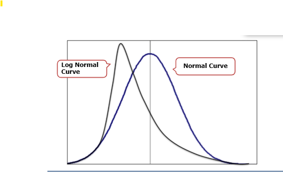
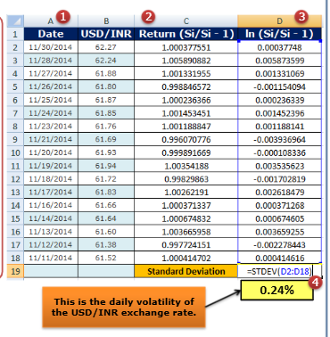
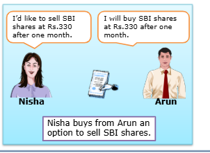

# Introduction to Options
Derivatives are classified into 3 building blocks.
* Credit Extension
* Price Fixing
* Price Insurance

Under price fixing contract, the parties are locked into a rate. On maturity, irrespective of prevailing market rate, they are obliged to deliver at the contracted price. So, on today, if two counter parties agree that they will buy the price X and sell the price Y and on maturity if the market price has gone down the buyers has to buy at price X and the seller has sell at price Y. However, under price insurance contract the owner or the buyer of the options retains the flexibility in case the market moves in his favor. If the market price of the underlying is better than the contracted price then he/she is free to deal in the market. He/she is not obliged to settle in the contract at the contracted price. This is a key differetiator in price insurance contract. So, on a similar example if the market has gone down the buyer may not carryout the trade.

## Options
A bought options position is therefore a perfect hedge in that; it has a limited downside and a potentially unlimited upside. As the owner of a price insurance contract, you can either exercise your right or walk away if it is advantageous for you to do so. The best of both worlds, isn't it? Well, there is a small catch. For this flexibility, the seller will charge you an upfront fee, which is called the option price or 'premium'.

Hence, option contracts can be defined as a contract where the holder has the right but not the obligation to buy or sell an 'underlying asset' at a pre-specified price (called the 'strike or exercise price') on or before a future date (called the expiry, maturity, strike or exercise date).
The 'underlying asset' could be an exchange rate, equity, commodity, or even another derivative product.

## Features of an Option
One-sided obligation
In an option, the buyer has the right but not the obligation. What about the other party-the seller of the option? It turns out that the seller of the option has an obligation to perform, if the buyer exercises his right. The seller cannot renege or walk away from the contract. Options thus create one way obligations. The seller of the option is obligated to perform.

Who then runs the credit risk in an option contract? The buyer of the contract is running a credit risk on the seller, and the seller runs the market risk.

## Options Terminology
Before we continue, let us get comfortable with the terms used in option contracts.

### Buyer or Holder
The buyer of the option contract is the entity that has the right. The buyer can buy the right to buy or the right to sell an underlying. The buyer may choose to exercise his right or walk away from the option contract, letting it expire worthless.

### Writer or Seller
The seller of an option contract is also called the writer of the option contract. The seller of the option contract is obligated to perform under the option contract if the buyer exercises his right.

### Underlying
The underlying is the asset on which the option contract is exercised. The underlying, as mentioned earlier, can be anything. Options have been written in the financial world on interest rates, bonds, stocks, commodities, foreign exchange rates, electricity, and even the weather!

### Expiry
An option contract provides a right to the owner for a particular tenor called the expiry period. If the option is not exercised at or before this expiry time it becomes worthless.

### Strike Price
The strike price of an option is the price at which the holder can buy (call) or sell (put) the underlying asset. In conventional options, the strike price is fixed on the trade date. For some exotic options, strike prices may be fixed in unusual ways. We will see some examples of these options later in the course.

### Exercise Style
Some options allow the holder the right to exercise only on the expiry date. These are European options (as in our illustration earlier). American options allow the holder the right to exercise any time up to and including the expiry date. The terms American and European have nothing to do with the location. You can buy American options in Europe or European Options in America.

### Premium
The price of an option contract is called the option premium. Later in the course, we will see how to arrive at the price of an option. The option premium is usually paid upfront. The premium is the net amount, the buyer of the option pays the seller of the option. It does not refer to an amount above the base price, as the term 'premium' commonly implies.

### Money-ness
Moneyness of an option describes where the strike price of an option is relative to the spot price of the underlying asset. In currency markets, moneyness is used where the strike price is compared with the forward price of the underlying.

It can be classified as shown below.
* In the Money
* At the Money
* Out of the Money

#### In the Money
An option is said to be 'in-the-money' if the holder of the option can profitably exercise the option today. Hence, for a call option the forward price must be more than the strike price for the option to be in the money. For a put option, the reverse holds true - the forward price must be lower than the strike price for the option to be in the money.

#### At the Money
If the strike price is equal to the forward price, the option is 'at the money'.

#### Out of the Money
An option is 'out of the money' if the option cannot be profitably exercised today. A call option is out of the money if the forward price is less than the strike price. A put option is out of the money if the forward price is more than the strike price.

Now, we can summarise the conditions for call and put options as shown below.

| | In the Money | At the Money | Out of the Money |
| - | ---------- | ------------ | ---------------- |
| Call | Fwd Price > Strike Price | Fwd Price = Strike Price | Fwd Price < Strike Price |
| Put | Fwd Price < Strike Price | Fwd Price = Strike Price | Fwd Price > Strike Price |

### Volatility
This is a commonly used and a very important term in options. Volatility or simply 'vols' refers to risk, arising out of the movements of the underlying asset. In statistical terms, it refers to the standard deviation of the underlying.

### How do we measure Volatility or Standard Deviation?
Remember, we are looking at the underlying asset, in our case say the exchange rate of USD/INR. We are looking to measure riskiness of the asset in terms of 'returns' earned on the asset. Returns are measured in absolute terms as (S₁/S-1) where S, is the spot exchange rate on day i and St.1 is the spot exchange rate on the previous day. If I were to calculate these returns for the past one year for USD/INR, we have the necessary data series for computing volatility. Just one last point, it has been observed that asset prices follow a log-normal and not a normal distribution (your bell shaped curve if you recall that).

A log-normal distribution simply means that if I were to take the natural log (In) (recall that I hope) of the variable, that data series will follow a normal distribution.
Trust me and accept it.
For those statistically inclined, a normal and a log normal distribution look like this.

Coming back to our volatility calculations, we need to convert our data into a normal distribution before we compute statistical measures like standard deviation. Hence, we take In (S;/S¡-1), as our data series and compute standard deviation. If you have Excel, all you need to do is to select the range of data and type in =STDEV(Data range)' in a cell where you want the standard deviation to appear, and you get your daily volatility for the USD/INR exchange rate.

As an exercise, let's find out the standard deviation of USD/INR exchange rate for a 15 day period. You can get this data easily from the RBI website.

We will do this using Excel.
1. Download the USD/INR exchange rate data from RBI website to an excel sheet.
2. Add a column to calculate the return (see the picture).
3. Add another column to calculate the log returns as shown in the picture.
4. Finally, enter the formula for standard deviation in a cell (D18).

If you need the 1 month volatility, simply multiply the above value (0.24%) by sqrt 'T', where T is the number of days. For a 30 day month, you will get 1.32%. In practice, the market would take 22 working days for the month. If you need the annualised vols, you multiply it (daily volatility) with sqrt 252, the number of trading days in the year.

We don't want to get into the math here, so you will need to again trust me on this one. This volatility data is available from the market as well, but just so that you know how these have been computed." So, what does volatility or vols mean in layman terms?

We had calculated the one month volatility of USD/INR exchange rate as 1.32%. Let's say that the current exchange rate is INR 62.50. This means, that intuitively speaking, the spot exchange rate after 1 month could be upto 1.32% higher i.e. 63.325, or 1.32% lower i.e. 61.675.

If you have access to a Reuters screen and you type in 'INRVOLFIX' you will get the vols data for USD/INR, for various maturities. It is mentioned in annualised percentage terms for a period, and ofcourse, that too has a bid and offer! We will explain how that works a little later.

### Intrinsic Value/Time Value
Intrinsic value is the value that is obtained if the option is exercised at the current spot price. Hence an in the money option has positive intrinsic value. Time value is the difference between the price paid for the option and its intrinsic value. Let me illustrate with an example.

Nisha buys from Arun an option that gives her the right to sell 100 SBI shares at Rs.330 anytime over the next 1 month. The market price of SBI is Rs.310. How much premium should Arun charge Nisha?

At least Rs.20 right, else he would be a moron. Anything less, Nisha pays the premium, buys the option and exercises her right; she makes Rs.20 less the premium paid. This is the **intrinsic value**. Now, the seller actually charges Nisha Rs.30 and not Rs.20. Why did he charge her this extra Rs.10?

This is to protect himself from any increase in his losses over the next 1 month. This Rs.10 is known as the **time value** of the option. Calculating time value is more complicated, as that is based on th volatility of the underlying.

### Tokyo/NY Cut
This last term is important for currency options. Let's take an example of a call option, that matures on September 15. Currency markets are open round the clock, especially for the major currencies. So, when do you look at the market rate on maturity?

At 11.00 a.m., 2.00 p.m., 5.30 p.m., which time zone etc. Hence it is necessary to have a convention for currency options. A NY cut/Tokyo cut option is whether the cut off time for exercising the option is as per NY 10:00 a.m. or Tokyo 3 p.m.

